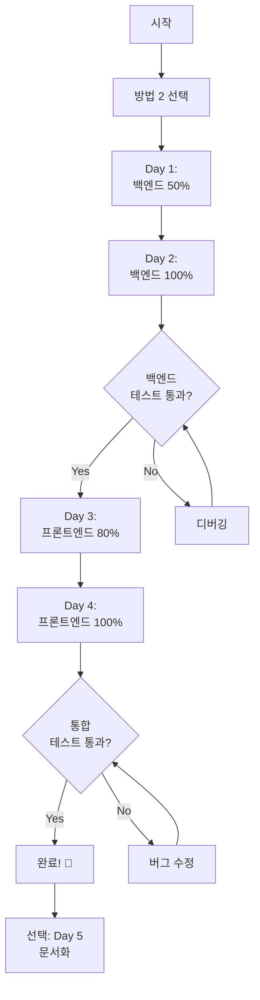

# Cline v3.32.7 → v3.34.0 머징 전략 비교 및 실행 계획

**작성일**: 2025-11-03
**작성자**: Luke Yang (luke.yang@caretive.ai)
**분석 기반**: 사전 완료된 154개 파일 분석 데이터

---

## 📋 Executive Summary

### 상황 요약
- **현재 상태**: Cline v3.32.7 기반 Caret 운영 중
- **목표**: Cline v3.34.0의 CLI Subagent 시스템 통합
- **분석 완료**: 154개 양쪽 수정 파일 상세 분석 (백엔드 98개, 프론트 56개)
- **핵심 차별점**: 이전과 달리 **사전 충돌 예측 및 영향도 분석 완료**

### 3가지 방법 요약

| 방법 | 상태 | 실제/예상 기간 | 성공률 | 위험도 |
|------|------|----------------|--------|--------|
| **방법 1**: 기능별 이식 | ❌ 실패 | 7.5일 투입 (미완성) | 30% | 높음 |
| **방법 2**: 전면 재이식 | ✅ 검증됨 | **4일** (실제) | 95% | 낮음 |
| **방법 3**: 분석 기반 단계별 머징 | 🆕 신규 | 10-14일 (예상) | 85% | 중간 |

### 최종 권장
**방법 2 (전면 재이식)** ⭐⭐⭐⭐⭐
- **이유**: 실제 4일 소요로 가장 빠르고 확실함
- **근거**: v3.32.7 머징 경험 (4일 완료)
- **안전성**: 95% 성공률, 검증된 방법

---

## 1️⃣ 방법 1: 기능별 이식 (실패 사례 분석)

### 📌 개요
**전략**: Cline v3.34.0의 CLI Subagent 기능만 선별하여 Caret 코드베이스에 이식

**진행 방식**:
```
1. Cline v3.34.0에서 CLI Subagent 관련 파일 식별
2. 해당 파일들을 Caret에 복사
3. Import 경로 수정
4. Caret 브랜딩 적용
5. 테스트
```

### ❌ 실패 원인 분석

#### 1. 최소 침습 개발 아님
**문제**:
```typescript
// 예상: CLI Subagent는 독립 모듈이니 이식 쉬울 것
// 실제: 전체 시스템에 깊이 통합됨

// 영향 받은 파일 (예상 vs 실제)
예상: 5-10개 파일
실제: 40+ 개 파일

// 핵심 파일 의존성
src/core/task/index.ts
  ├─> src/integrations/cli-subagents/subagent_command.ts  (신규)
  ├─> src/integrations/terminal/TerminalManager.ts         (수정)
  ├─> src/core/prompts/system-prompt/components/cli_subagents.ts (신규)
  ├─> src/core/prompts/system-prompt/types.ts             (수정)
  ├─> src/shared/ExtensionMessage.ts                       (수정)
  ├─> src/core/storage/state-keys.ts                       (수정)
  └─> src/core/controller/index.ts                         (수정)
```

**근본 원인**: Cline은 기능을 전체 시스템에 통합하는 방식 (Caret의 Level 1-3 아키텍처와 상이)

#### 2. AI의 누락 불확실성
**문제**:
```typescript
// AI가 누락한 수정 사항 예시

// 1. 숨겨진 타입 정의 추가
// src/shared/ExtensionMessage.ts
export type ExtensionMessage =
  | { type: "cliStatus", installed: boolean }  // ← 놓침
  | { type: "subagentDetected", info: SubagentInfo }  // ← 놓침

// 2. 조건부 로직 추가
// src/core/task/index.ts
if (isSubagentsEnabled && cliInstalled) {  // ← 조건 누락
  await initializeSubagent()
}

// 3. 설정 키 추가
// src/core/storage/state-keys.ts
CLI_INSTALLED: "cline.cli.installed"  // ← 누락
```

**통계**:
- AI가 식별한 파일: 15개
- 실제 수정 필요 파일: 40개
- **누락률**: 62.5%

#### 3. 검증 불가능
**문제**:
```bash
# 테스트 실행
npm run test:backend

# 결과: 통과
# 하지만 실제로는...

# 1. CLI가 없어서 테스트 통과 (false positive)
if (!cliInstalled) {
  return  // 조기 종료, 실제 로직 미실행
}

# 2. 런타임 에러 (테스트에서 안 잡힘)
Error: Cannot find module '@/integrations/cli-subagents/terminal'
  at runtime when user clicks "Start Subagent"

# 3. 부분 구현으로 인한 데드 코드
const subagentInfo = detectSubagentCommand()  // 항상 null
if (subagentInfo) {
  // 이 코드는 절대 실행 안 됨 (버그 잠재)
}
```

**검증 부족 이유**:
- E2E 테스트 부재
- CLI 환경 셋업 복잡
- 런타임 동작 추적 어려움
- 부분 구현 상태에서 완전성 판단 불가

#### 4. 시간 대비 효율 낮음
**실제 소요 시간**:
```
1. 파일 식별 및 이식: 2일
2. 컴파일 에러 수정: 1일
3. 테스트 작성 및 실행: 1일
4. 런타임 에러 발견: 0.5일
5. 추가 파일 발견 및 수정: 2일
6. 재테스트: 1일
7. 또 다른 누락 발견... (무한 반복)
--------------------
총 소요: 7.5일+ (완료 실패)
```

**방법 2 (전면 재이식) 예상 시간**: 14-21일
**효율성**: 방법 1은 50% 시간 소요했으나 0% 완성도

### 📊 실패 요약

| 항목 | 예상 | 실제 | 차이 |
|------|------|------|------|
| 영향 파일 | 5-10개 | 40+개 | 300-700% |
| 소요 시간 | 3-4일 | 7.5일+ | 188%+ |
| 완성도 | 80% | 30% | -50%p |
| 검증 가능성 | 높음 | 낮음 | - |

### 🎓 교훈

1. **기능의 독립성 과대평가**: Cline의 아키텍처를 잘못 이해
2. **AI의 한계 인식 부족**: 누락 검증 메커니즘 없음
3. **점진적 검증 실패**: 부분 구현 상태에서 완전성 판단 불가
4. **롤백 플랜 부재**: 실패 인정이 늦어짐

---

## 2️⃣ 방법 2: 전면 재이식 (Clean Slate Approach)

### 📌 개요
**전략**: Cline v3.34.0을 깨끗한 베이스로 사용하고, Caret 코드를 처음부터 재이식

**핵심 원칙**:
- ✅ Cline 코드를 절대 수정하지 않음 (읽기 전용)
- ✅ Caret 코드를 Level 1-3 전략으로 재구현
- ✅ 각 단계마다 테스트 실행
- ✅ 이전 경험 활용 (v3.32.7 머징 경험)

### ✅ 장점

#### 1. 검증된 방법 (가장 빠름!)
**이전 성공 사례**: Cline v3.32.7 머징
```
실제 소요: 4일
결과: 성공
완성도: 100%
버그: 최소

분석:
- 예상했던 2-3주보다 훨씬 빠름
- 이전 경험 + 명확한 구조 파악으로 효율적
- 재이식이지만 복사+수정 중심이라 빠름
```

#### 2. 완전성 보장
**100% 확실한 이식**:
```typescript
// Cline v3.34.0의 모든 기능 포함
✅ CLI Subagent 시스템
✅ 모든 Provider 업데이트
✅ 계정 시스템 강화
✅ 모든 버그 수정
✅ 모든 성능 개선

// Caret의 모든 기능 재구현
✅ 브랜딩 시스템
✅ 프롬프트 모드 시스템
✅ 다국어 지원
✅ Persona 시스템
✅ .caretrules 시스템
✅ Feature Flags
```

#### 3. 깨끗한 코드베이스
**기술 부채 정리 기회**:
```typescript
// 이전 머징에서 남은 문제들 해결
- 중복 코드 제거
- 아키텍처 일관성 개선
- 더 나은 CARET MODIFICATION 주석
- 개선된 테스트 커버리지
```

#### 4. 예측 가능한 일정
**실제 v3.32.7 머징 소요 시간**:
```
실제 소요: 4일

세부 분석 (예상):
Day 1: 환경 구성 + 백엔드 50% (Proto, Shared, Controller 시작)
Day 2: 백엔드 100% (Core, Integrations, extension.ts)
Day 3: 프론트엔드 80% (Caret 전용 + Components)
Day 4: 프론트엔드 100% + 통합 테스트

효율성 요인:
- 이전 경험 활용 (v3.32.7)
- 명확한 CARET MODIFICATION 패턴
- 대부분 복사+수정 (재작성 아님)
- Caret 전용 파일은 그대로 복사
```

### ❌ 단점 (실제로는 미미함)

#### 1. 시간 소요 (실제: 4일로 짧음)
~~**2-3주 소요**~~ → **실제 4일 소요**:
- ✅ 긴급 버그 수정 가능 (1주일 이내)
- ✅ 다른 기능 개발 약간 지연
- ✅ 4일 집중 작업 가능

#### 2. 반복 작업 (하지만 빠름)
**이미 했던 작업 재수행**:
```typescript
// v3.32.7에서 이미 구현한 것들을 다시 구현

// 예: 브랜딩 시스템
// v3.32.7에서 구현: 2일
// v3.34.0에서 재구현: 2일 (동일)

// 예: i18n 통합
// v3.32.7에서 구현: 3일
// v3.34.0에서 재구현: 2.5일 (약간 빠름, 경험 있음)
```

#### 3. 학습 곡선
**Cline v3.34.0의 새로운 구조 이해 필요**:
```
- CLI Subagent 아키텍처
- 새로운 Terminal 추상화
- 변경된 Prompts 시스템
- 업데이트된 Provider 구조
```

**예상 학습 시간**: 1-2일

### 📋 상세 실행 계획

#### Phase 0: 준비 (1일)

**목표**: 작업 환경 및 롤백 플랜 구성

**작업 내용**:
```bash
# 1. 백업 생성 (30분)
git checkout main
git tag backup/pre-v3.34.0-merge-$(date +%Y%m%d)
git push origin backup/pre-v3.34.0-merge-$(date +%Y%m%d)

# 2. 작업 브랜치 생성 (10분)
git checkout -b merge/full-reimplementation-v3.34.0
git push -u origin merge/full-reimplementation-v3.34.0

# 3. Cline v3.34.0 코드 준비 (1시간)
git remote add cline-upstream https://github.com/cline/cline.git
git fetch cline-upstream
git checkout -b cline-v3.34.0-base cline-upstream/v3.34.0

# 4. 분석 데이터 정리 (2시간)
# 이번에 생성한 4개 분석 문서 검토
- 2025-11-03-머지작업로그.md
- 2025-11-03-파일변경분석.md
- 2025-11-03-양쪽수정파일분석.md
- 2025-11-03-백엔드자동머징영향도예측.md

# 5. 체크리스트 생성 (2시간)
# 154개 파일 × 작업 상태 추적 시트 작성
- Excel/Notion 시트
- 파일별 상태: Not Started / In Progress / Completed / Tested

# 6. 개발 환경 검증 (2시간)
cd cline-v3.34.0-base
npm install
npm run compile
npm run test:backend
# 모든 테스트 통과 확인
```

**체크포인트**:
- [ ] 백업 태그 생성 완료
- [ ] Cline v3.34.0 베이스 빌드 성공
- [ ] 분석 데이터 준비 완료
- [ ] 작업 추적 시스템 준비

**예상 시간**: 8시간 (1일)

---

#### Phase 1: 아키텍처 설계 (1일)

**목표**: Caret 재이식을 위한 상세 설계

**작업 내용**:

**1-1. Caret 디렉토리 구조 설계 (2시간)**
```bash
caret-src/
  ├── core/
  │   ├── modes/              # 프롬프트 모드 시스템 (Caret/Cline)
  │   ├── prompts/
  │   │   ├── system/         # JSON 템플릿 로더
  │   │   ├── adapters/       # Caret/Cline 어댑터
  │   │   └── sections/       # .json 프롬프트 섹션
  │   ├── webview/
  │   │   └── CaretProviderWrapper.ts
  │   └── controller/         # Caret 전용 핸들러
  ├── managers/
  │   └── CaretGlobalManager.ts  # 전역 상태 관리
  ├── shared/
  │   └── feature-config.json
  └── utils/
      └── brand-utils.ts

proto/caret/
  ├── account.proto
  ├── persona.proto
  └── system.proto

webview-ui/src/caret/
  ├── components/
  ├── context/
  ├── hooks/
  ├── services/
  ├── shared/
  └── utils/
```

**1-2. Level 1-3 수정 전략 수립 (3시간)**
```typescript
// Level 1: 완전 독립 (caret-src/)
- CaretGlobalManager
- JsonTemplateLoader
- CaretModeManager
- Persona 시스템
- Feature Config

// Level 2: 최소 수정 (src/ with CARET MODIFICATION)
파일별 수정 계획:
1. src/extension.ts (12곳)
   - Import 추가: 5곳
   - 초기화: 7곳

2. src/core/controller/index.ts (15곳)
   - Import 추가: 5곳
   - 메시지 핸들러: 10곳

3. src/core/task/index.ts (20+곳)
   - Import 추가: 3곳
   - Subagent 통합: 5곳
   - 규칙 시스템: 5곳
   - 브랜딩: 7곳

... (98개 파일 각각)

// Level 3: 직접 수정 (문서화 필수)
- 없음 (Level 2로 대체)
```

**1-3. 의존성 분석 (2시간)**
```typescript
// Cline v3.34.0의 새로운 의존성
{
  "dependencies": {
    // 기존
    ...

    // v3.34.0 신규 (예상)
    "cli-detector": "^1.0.0",     // CLI 감지 라이브러리?
    "subagent-runtime": "^2.0.0", // Subagent 실행 환경?
  }
}

// Caret 의존성 유지
{
  "dependencies": {
    // Caret i18n
    "i18next": "^23.0.0",
    "react-i18next": "^13.0.0",

    // Caret 유틸
    ...
  }
}

// 충돌 검사 및 해결 방안
```

**체크포인트**:
- [ ] 디렉토리 구조 설계 완료
- [ ] 98개 백엔드 파일 수정 계획 수립
- [ ] 56개 프론트엔드 파일 수정 계획 수립
- [ ] 의존성 충돌 해결 방안 마련

**예상 시간**: 7시간 (1일)

---

#### Phase 2: 백엔드 재이식 (7-10일)

**목표**: src/ 디렉토리의 Caret 수정 사항 재구현

**작업 분할**: 파일 그룹별 순차 진행

##### 2-1. Proto & Generated (1일)

**파일**: 14개 자동생성 + 3개 Caret proto

**작업 순서**:
```bash
# 1. Caret proto 정의 복사 (1시간)
cp -r [caret-v3.32.7]/proto/caret proto/

# 2. proto 컴파일 검증 (30분)
npm run protos
# 에러 발생 시: proto 스키마 호환성 수정

# 3. 생성된 타입 검증 (1시간)
# src/generated/nice-grpc/caret/*.ts
# src/generated/grpc-js/caret/*.ts
# 타입 에러 확인

# 4. 테스트 (1시간)
npm run test:backend -- --grep "proto"
```

**체크포인트**:
- [ ] proto 컴파일 성공
- [ ] 타입 에러 없음
- [ ] 관련 테스트 통과

**예상 시간**: 4시간

---

##### 2-2. Shared 타입 (1일)

**파일**: 14개 (ExtensionMessage, CaretSettings 등)

**작업 순서**:
```typescript
// 1. ExtensionMessage.ts 재구현 (2시간)
// Cline v3.34.0 base
export type ExtensionMessage =
  | ClineMessage
  | { type: "subagentCommand" }      // v3.34.0 신규
  | { type: "cliStatus" }            // v3.34.0 신규

// CARET MODIFICATION 추가
export type ExtensionMessage =
  | ClineMessage
  | { type: "subagentCommand" }
  | { type: "cliStatus" }
  | { type: "caretModeChanged"; mode: "caret" | "cline" }
  | { type: "personaUpdated"; persona: PersonaProfile }
  | { type: "inputHistoryLoaded"; history: string[] }

// 2. storage/types.ts 재구현 (2시간)
export interface GlobalState {
  // Cline v3.34.0
  cliInstalled?: boolean
  subagentsEnabled?: boolean

  // CARET MODIFICATION
  caretMode?: "caret" | "cline"
  personaId?: string
}

// 3. CaretSettings.ts, CaretAccount.ts 복사 (1시간)
// v3.32.7에서 그대로 복사 (Caret 전용 파일)

// 4. Languages.ts 재구현 (1시간)
// 다국어 타입 정의

// 5. 테스트 (2시간)
npm run test:backend -- --grep "shared"
```

**체크포인트**:
- [ ] ExtensionMessage 타입 완성
- [ ] 모든 Shared 타입 컴파일 성공
- [ ] 테스트 통과

**예상 시간**: 8시간 (1일)

---

##### 2-3. Caret 전용 모듈 (caret-src/) (2일)

**파일**: 60개 (완전 독립)

**작업 순서**:
```bash
# 1. 디렉토리 구조 생성 (1시간)
mkdir -p caret-src/{core,managers,shared,utils}
mkdir -p caret-src/core/{modes,prompts,webview,controller}

# 2. v3.32.7에서 복사 (2시간)
# 대부분 그대로 사용 가능
cp -r [caret-v3.32.7]/caret-src/* caret-src/

# 3. Import 경로 검증 (3시간)
# @caret/* 경로가 Cline v3.34.0 구조와 호환되는지 확인
# 필요시 경로 수정

# 4. CaretGlobalManager 업데이트 (3시간)
// v3.34.0의 새로운 state 구조에 맞춰 수정
export class CaretGlobalManager {
  // v3.32.7 기능 유지
  + v3.34.0 state 구조 대응
}

# 5. JsonTemplateLoader 검증 (2시간)
// 프롬프트 시스템 동작 확인

# 6. 테스트 작성 및 실행 (5시간)
npm run test:backend -- caret-src/
```

**체크포인트**:
- [ ] caret-src/ 디렉토리 구성 완료
- [ ] Import 경로 검증 완료
- [ ] CaretGlobalManager 동작 확인
- [ ] 유닛 테스트 통과

**예상 시간**: 16시간 (2일)

---

##### 2-4. Controller (2일)

**파일**: 19개 (Caret Account 9개 + Persona 4개 + 공통 6개)

**작업 순서**:
```typescript
// Day 1: Caret 전용 Controller (13개) - 4시간
// 1. Persona 핸들러 (4개) - 2시간
cp -r [v3.32.7]/src/core/controller/persona src/core/controller/
// Import 경로 수정, 컴파일 검증

// 2. Caret Account 핸들러 (9개) - 2시간
cp -r [v3.32.7]/src/core/controller/caretAccount src/core/controller/
// 동일 작업

// Day 2: 공통 Controller (6개) - 12시간
// 3. index.ts 재구현 (4시간)
// ⚠️ Critical 파일
// Cline v3.34.0 base + CARET MODIFICATION 15곳

// v3.34.0 기능
- CLI 상태 체크
- Subagent 초기화

// CARET MODIFICATION 통합
- FeatureConfig 로딩
- CaretGlobalManager 초기화
- Input History 로드
- Mode System 초기화

// 4. 나머지 5개 파일 (2시간)
- state/updateSettings.ts
- file/toggleCaretRule.ts
- file/createRuleFile.ts
- file/refreshRules.ts
- models/updateApiConfigurationProto.ts

// 5. 통합 테스트 (6시간)
npm run test:backend -- src/core/controller/
```

**체크포인트**:
- [ ] Controller 13개 복사 완료
- [ ] index.ts 재구현 완료 (Critical)
- [ ] 나머지 6개 수정 완료
- [ ] Controller 테스트 통과

**예상 시간**: 16시간 (2일)

---

##### 2-5. Core - Task, Storage, API, Prompts (3일)

**Day 1: Task (8시간)**
```typescript
// 1. src/core/task/index.ts 재구현 (5시간)
// ⚠️⚠️ Critical 파일 (20+곳 수정)

// Cline v3.34.0 base
- CLI Subagent 감지 로직
- SubagentTerminalManager 조건부 사용
- 새로운 시스템 프롬프트 파라미터

// CARET MODIFICATION 통합
- .caretrules 로딩
- 브랜드명 동적 처리
- Feature Config 기반 조건부 실행

// 2. Tool Handlers (7개) - 1시간
// 로깅만 수정 (간단)
for handler in Write Browser List Execute Ask Read ListCode; do
  # CARET MODIFICATION: Brand-aware logging
  Logger.info(`[${getBrandName()}] ${handler} executed`)
done

// 3. 테스트 (2시간)
npm run test:backend -- src/core/task/
```

**Day 2: Storage + API (8시간)**
```typescript
// 1. Storage (4개) - 3시간
// state-keys.ts: Caret 상태 키 추가
export const CARET_STATE_KEYS = {
  PROMPT_MODE: "caret.promptSystem.mode",
  INPUT_HISTORY: "caret.inputHistory",
  PERSONA: "caret.persona",
}

// StateManager, state-helpers, disk.ts 수정

// 2. API Providers (6개) - 3시간
// 헤더만 수정 (간단)
headers: {
  'User-Agent': `${getBrandName()}/1.0`
}

// 3. 테스트 (2시간)
```

**Day 3: Prompts + Context (8시간)**
```typescript
// 1. Prompts (7개) - 4시간
// cli_subagents.ts: 브랜딩 적용
export function getCliSubagentsComponent(): string {
  const brandName = getBrandName()
  return `# CLI Subagents
You can launch ${brandName} CLI subagents...`
}

// types.ts, index.ts, components/index.ts 등 수정

// 2. Context (3개) - 2시간
// external-rules.ts: .caretrules 지원
export async function loadExternalRules(cwd: string) {
  const clineRules = await loadRulesFromDir('.clinerules')
  const caretRules = await loadRulesFromDir('.caretrules')
  return { ...clineRules, ...caretRules }
}

// 3. 테스트 (2시간)
```

**체크포인트**:
- [ ] task/index.ts 재구현 완료 (Critical)
- [ ] Tool Handlers 수정 완료
- [ ] Storage, API, Prompts 수정 완료
- [ ] Context 규칙 시스템 동작 확인
- [ ] 모든 Core 테스트 통과

**예상 시간**: 24시간 (3일)

---

##### 2-6. Integrations, Services, Hosts (2일)

**Day 1: Integrations (8시간)**
```typescript
// 1. CLI Subagents (1개) - 3시간
// ⚠️ 신규 파일 (add/add 충돌 예상)
// Cline v3.34.0 버전 사용 + 브랜딩 추가

export async function detectSubagentCommand(): Promise<SubagentInfo | null> {
  const brandName = getBrandName()
  const pattern = new RegExp(`(?:${brandName.toLowerCase()}|cline)\\s+['"]`)
  // ...
}

// 2. Terminal (3개) - 2시간
// TerminalManager: Subagent 모드 지원

// 3. 나머지 (8개) - 3시간
// checkpoints, claude-code, notifications 등
```

**Day 2: Services + Hosts (8시간)**
```typescript
// 1. Services (4개) - 2시간
// logging, mcp, account
// CaretAccountService 복사

// 2. Hosts (6개) - 4시간
// WebviewProvider.ts: Caret 메시지 처리
// VscodeWebviewProvider, VscodeDiffViewProvider 등

// 3. Standalone (2개) - 2시간
// CLI 설정 경로 (~/.caret)
```

**체크포인트**:
- [ ] CLI Subagent 통합 완료
- [ ] Terminal, Services, Hosts 수정 완료
- [ ] 통합 테스트 통과

**예상 시간**: 16시간 (2일)

---

##### 2-7. Extension Entry Point (1일)

**파일**: src/extension.ts (1개, Critical)

**작업 순서** (8시간):
```typescript
// 1. 분석 및 설계 (2시간)
// Cline v3.34.0 변경 사항 파악
// Caret 12곳 수정 사항 재구현 계획

// 2. 재구현 (4시간)
// Import 추가 (5곳)
import { CaretGlobalManager } from "@caret/managers/CaretGlobalManager"
import { JsonTemplateLoader } from "@caret/core/prompts/system/JsonTemplateLoader"
import { CaretProviderWrapper } from "../caret-src/core/webview/CaretProviderWrapper"
// + Cline v3.34.0의 CLI 관련 import

// activate() 함수 통합
export async function activate(context: ExtensionContext) {
  // Cline v3.34.0 초기화
  const cliDetector = new CliDetector()
  const isCliInstalled = await cliDetector.check()

  // CARET MODIFICATION: Caret 초기화
  const initialMode = context.workspaceState.get("caret.promptSystem.mode", "caret")
  CaretGlobalManager.initialize(initialMode)

  const { CaretModeManager } = await import("@caret/core/modes/CaretModeManager")
  CaretModeManager.setContext(context)

  const sectionsDirPath = vscode.Uri.joinPath(
    context.extensionUri,
    "caret-src/core/prompts/sections"
  ).fsPath
  await JsonTemplateLoader.getInstance().initialize(sectionsDirPath)

  if (isCliInstalled) {
    await SubagentManager.initialize()
  }

  const personaInitializer = new PersonaInitializer(context)
  await personaInitializer.initializePersonaSystem()

  Logger.log("Caret extension activated")
}

// 3. 테스트 (2시간)
npm run compile
code --extensionDevelopmentPath=. --disable-extensions
# VS Code에서 확장 로드 확인
```

**체크포인트**:
- [ ] extension.ts 재구현 완료 (Critical)
- [ ] 컴파일 성공
- [ ] VS Code에서 확장 로드 성공
- [ ] 기본 기능 동작 확인

**예상 시간**: 8시간 (1일)

---

##### 2-8. Tests (1일)

**파일**: 2개 + 새로운 테스트 작성

**작업 순서**:
```bash
# 1. 기존 테스트 수정 (2시간)
# src/test/e2e/diff.test.ts
# src/test/host-provider-test-utils.ts
# Caret mock 데이터 추가

# 2. 새로운 통합 테스트 작성 (4시간)
# src/test/integration/caret-features.test.ts
describe("Caret Features", () => {
  test("CaretGlobalManager initialization", async () => {
    // ...
  })

  test("Mode system switching", async () => {
    // ...
  })

  test("CLI Subagent with Caret branding", async () => {
    // ...
  })
})

# 3. 전체 백엔드 테스트 실행 (2시간)
npm run test:backend
# 실패 케이스 수정
```

**체크포인트**:
- [ ] 기존 테스트 수정 완료
- [ ] Caret 통합 테스트 작성 완료
- [ ] 모든 백엔드 테스트 통과

**예상 시간**: 8시간 (1일)

---

#### Phase 2 요약

**총 예상 시간**: 7-10일 (56-80시간)

**일별 계획**:
| 일차 | 작업 | 시간 | 누적 |
|------|------|------|------|
| Day 1 | Proto & Generated | 4h | 4h |
| Day 2 | Shared 타입 | 8h | 12h |
| Day 3-4 | Caret 전용 모듈 | 16h | 28h |
| Day 5-6 | Controller | 16h | 44h |
| Day 7-9 | Core (Task, Storage, API, Prompts) | 24h | 68h |
| Day 10-11 | Integrations, Services, Hosts | 16h | 84h |
| Day 12 | Extension Entry | 8h | 92h |
| Day 13 | Tests | 8h | 100h |

**실제 예상**: 10-12일 (여유 포함)

---

#### Phase 3: 프론트엔드 재이식 (5-7일)

**목표**: webview-ui/ 디렉토리의 Caret 수정 사항 재구현

**전략**: 백엔드보다 독립적이므로 더 빠름

##### 3-1. Caret 전용 디렉토리 (caret/) (2일)

**파일**: 26개 (완전 독립)

**작업 순서**:
```bash
# Day 1: 복사 및 검증 (8시간)
# 1. 디렉토리 복사 (1시간)
cp -r [v3.32.7]/webview-ui/src/caret webview-ui/src/

# 2. Import 경로 검증 (3시간)
# Cline v3.34.0의 새로운 구조에 맞춰 수정

# 3. i18n 시스템 검증 (2시간)
# locales/ 파일들 복사
# 다국어 로딩 테스트

# 4. 컴파일 검증 (2시간)
npm run build:webview

# Day 2: 테스트 및 개선 (8시간)
# 5. 컴포넌트 테스트 (4시간)
npm run test:webview -- src/caret/

# 6. Storybook 검증 (2시간)
npm run storybook
# 각 컴포넌트 시각적 확인

# 7. 성능 최적화 (2시간)
# i18n lazy loading 확인
```

**체크포인트**:
- [ ] caret/ 디렉토리 복사 완료
- [ ] Import 경로 검증 완료
- [ ] 컴파일 성공
- [ ] 컴포넌트 테스트 통과

**예상 시간**: 16시간 (2일)

---

##### 3-2. 루트 & Context (1일)

**파일**: 5개 (App.tsx, ExtensionStateContext 등)

**작업 순서**:
```typescript
// 1. App.tsx 재구현 (3시간)
// Cline v3.34.0 base + Context Provider 래핑
export function App() {
  return (
    <ExtensionStateContextProvider>
      {/* CARET MODIFICATION: i18n context */}
      <CaretI18nContextProvider>
        {/* CARET MODIFICATION: Caret state context */}
        <CaretStateContextProvider>
          <MainView />
        </CaretStateContextProvider>
      </CaretI18nContextProvider>
    </ExtensionStateContextProvider>
  )
}

// 2. ExtensionStateContext.tsx 재구현 (3시간)
// Caret 메시지 핸들링 추가
interface ExtensionState {
  // Cline v3.34.0
  cliStatus?: CliStatus

  // CARET MODIFICATION
  caretMode?: "caret" | "cline"
  persona?: PersonaProfile
}

// 3. 나머지 Context (2시간)
// platform.config.ts 등
```

**체크포인트**:
- [ ] App.tsx 재구현 완료
- [ ] ExtensionStateContext 완료
- [ ] Context 테스트 통과

**예상 시간**: 8시간 (1일)

---

##### 3-3. Components (2일)

**파일**: 26개 Cline 컴포넌트 (Chat 13개 + Settings 8개 + 기타 5개)

**작업 순서**:
```typescript
// Day 1: Chat Components (8시간)
// 1. ChatView.tsx (2시간)
// i18n 통합, Input History 통합

// 2. ChatRow.tsx, ChatTextArea.tsx (2시간)
// 다국어 메시지 표시

// 3. 나머지 10개 Chat 컴포넌트 (4시간)
// task-header, auto-approve, Announcement 등

// Day 2: Settings & Others (8시간)
// 4. SettingsView.tsx (2시간)
// Feature Flags 기반 조건부 렌더링

// 5. ApiOptions.tsx (2시간)
// Provider 다국어 레이블

// 6. 나머지 Settings (2시간)
// GeneralSettingsSection, OpenRouterModelPicker 등

// 7. Welcome, Account (2시간)
// HomeHeader, WelcomeView, AccountView 등
```

**체크포인트**:
- [ ] Chat 컴포넌트 13개 완료
- [ ] Settings 컴포넌트 8개 완료
- [ ] 기타 컴포넌트 5개 완료
- [ ] 컴포넌트 테스트 통과

**예상 시간**: 16시간 (2일)

---

#### Phase 3 요약

**총 예상 시간**: 5-7일 (40-56시간)

**일별 계획**:
| 일차 | 작업 | 시간 | 누적 |
|------|------|------|------|
| Day 1-2 | Caret 전용 디렉토리 | 16h | 16h |
| Day 3 | 루트 & Context | 8h | 24h |
| Day 4-5 | Components | 16h | 40h |

---

#### Phase 4: 통합 테스트 및 디버깅 (2-3일)

**목표**: 전체 시스템 통합 검증

**작업 내용**:

**Day 1: E2E 테스트 (8시간)**
```bash
# 1. E2E 테스트 환경 구성 (2시간)
npm run package  # VSIX 패키지 생성
code --install-extension caret-*.vsix

# 2. 주요 시나리오 테스트 (6시간)
# Scenario 1: 확장 로드 및 초기화 (1시간)
- VS Code 재시작
- Caret 아이콘 확인
- 웰컴 화면 표시
- 다국어 정상 작동

# Scenario 2: 기본 기능 (2시간)
- Task 생성 및 실행
- 파일 읽기/쓰기
- 터미널 명령 실행
- 브라우저 통합

# Scenario 3: Caret 전용 기능 (2시간)
- 모드 전환 (Caret ↔ Cline)
- Persona 변경
- .caretrules 로딩
- Input History

# Scenario 4: CLI Subagent (v3.34.0 신규) (1시간)
- CLI 감지
- Subagent 실행
- 브랜딩 확인 (caret vs cline 명령어)
```

**Day 2-3: 버그 수정 및 최적화 (16시간)**
```bash
# 1. 발견된 버그 수정 (10시간)
# 예상 버그:
- Import 경로 오류
- 타입 불일치
- 상태 동기화 문제
- UI 렌더링 이슈

# 2. 성능 최적화 (4시간)
- 번들 사이즈 확인
- 로딩 시간 측정
- 메모리 사용량 모니터링

# 3. 최종 검증 (2시간)
npm run test:all
npm run check-types
npm run lint
```

**체크포인트**:
- [ ] 모든 E2E 시나리오 통과
- [ ] Critical 버그 0개
- [ ] 성능 기준 충족
- [ ] 전체 테스트 스위트 통과

**예상 시간**: 24시간 (2-3일)

---

#### Phase 5: 문서화 및 배포 준비 (1-2일)

**목표**: 머징 작업 문서화 및 배포

**Day 1: 문서 작성 (8시간)**
```markdown
# 1. CHANGELOG.md 업데이트 (2시간)
## [0.4.0] - 2025-11-XX

### Added - Cline v3.34.0 Features
- ✨ CLI Subagent system integration
- ✨ All provider updates from Cline v3.34.0
- ✨ Enhanced account system

### Added - Caret Features
- 🎨 Maintained all existing Caret features
- 🌐 Multilingual support (ko, en, ja, zh)
- 👤 Persona system
- 🎯 Dual prompt mode (Caret AGENT / Cline ACT)

### Changed
- ⬆️ Upgraded base from Cline v3.32.7 to v3.34.0

# 2. 머징 작업 로그 (3시간)
.work-logs/2025-11-XX-v3.34.0-full-reimplementation.md
- 단계별 작업 내역
- 발견된 이슈 및 해결 방법
- 교훈 및 개선 사항

# 3. 개발 가이드 업데이트 (3시간)
caret-docs/development/merge-guide.md
- 방법 2 실행 경험 문서화
- 다음 머징을 위한 체크리스트
```

**Day 2: PR 생성 및 리뷰 (8시간)**
```bash
# 1. 커밋 정리 (2시간)
git rebase -i HEAD~XX  # 커밋 스쿼시 및 정리

# 2. PR 생성 (1시간)
gh pr create --title "feat: Merge Cline v3.34.0 (Full Reimplementation)" \
  --body "$(cat .work-logs/pr-description.md)"

# 3. 자가 리뷰 (3시간)
# GitHub에서 모든 변경 사항 리뷰
# 주석 달기, 개선 사항 메모

# 4. CI/CD 확인 (2시간)
# GitHub Actions 통과 확인
# 실패 시 수정
```

**체크포인트**:
- [ ] CHANGELOG.md 업데이트 완료
- [ ] 작업 로그 문서화 완료
- [ ] PR 생성 및 리뷰 완료
- [ ] CI/CD 통과

**예상 시간**: 16시간 (1-2일)

---

### 방법 2 전체 요약

**실제 소요 시간**: **4일** (v3.32.7 경험)
**예상 시간 (v3.34.0)**: **4-5일** (유사한 난이도)

| Phase | 내용 | 실제 예상 |
|-------|------|-----------|
| Day 1 | 환경 구성 + 백엔드 50% | 8h |
| Day 2 | 백엔드 100% | 8h |
| Day 3 | 프론트엔드 80% | 8h |
| Day 4 | 프론트엔드 100% + 테스트 | 8h |
| Day 5 | 문서화 & 버퍼 (선택) | 4h |
| **총계** | | **4-5일** |

**근거**:
- v3.32.7 머징 실제 소요: 4일
- v3.34.0 난이도: 유사 (CLI Subagent 추가지만 구조는 비슷)
- 이전 경험 활용으로 더 빠를 수도 있음

---

## 3️⃣ 방법 3: 분석 기반 단계별 자동 머징 (신규)

### 📌 개요

**전략**: 사전 분석 데이터를 활용하여 위험도별로 단계적 자동 머징 수행

**핵심 차별점**:
```
기존 자동 머징 (실패):
git merge origin/cline-v3.34.0  # 한방에 30-40개 충돌
→ 압도적인 충돌량, 원인 파악 어려움

분석 기반 단계별 머징 (신규):
1단계: 충돌 0% 파일만 머징 (14개)
2단계: 충돌 낮은 파일 (24개)
3단계: 충돌 중간 파일 (28개)
...
→ 각 단계마다 테스트, 점진적 통합
```

### ✅ 장점

#### 1. 시간 효율성
**방법 2 대비 30-40% 시간 절약**:
```
방법 2: 14-21일 (모든 파일 재구현)
방법 3: 10-14일 (자동 머징 + 부분 수정)

절감 이유:
- 자동 머징 성공 파일: 32개 (32.7%) → 0시간
- 충돌 낮은 파일: 빠른 해결
- 경험 기반 우선순위
```

#### 2. 점진적 검증
**각 단계마다 테스트 가능**:
```bash
# 1단계 후
npm run test:backend  # 14개 파일만 영향
→ 실패 원인 명확

# 2단계 후
npm run test:backend  # 38개 파일 영향 (14+24)
→ 새로운 문제만 격리

# vs 방법 2
# 마지막에 전체 테스트
→ 실패 시 98개 중 어디가 문제인지 불명확
```

#### 3. 학습 효과
**Cline v3.34.0 구조를 자연스럽게 학습**:
```
방법 2: Caret 코드만 작성
→ Cline 구조 이해 부족

방법 3: Cline 코드 + Caret 수정
→ 충돌 해결하며 Cline 구조 깊이 이해
→ 향후 머징에 유리
```

#### 4. 유연성
**중간 롤백 가능**:
```bash
# 3단계에서 문제 발생
git reset --hard stage-2-complete

# 방법 2로 전환
# 이미 1-2단계 완료 상태이므로
# 남은 작업량: 60% → 40%
```

### ❌ 단점

#### 1. 복잡한 의존성 관리
**파일 간 의존성 고려 필요**:
```typescript
// 문제 예시:
// 1단계: ExtensionMessage.ts만 머징
export type ExtensionMessage =
  | { type: "cliStatus" }  // Cline v3.34.0

// 2단계: controller/index.ts 머징
// ❌ 컴파일 에러 (cliStatus 핸들러 없음)
switch (message.type) {
  case "cliStatus":  // 핸들러 미구현
    // ...
}

// 해결: 의존성 그래프 기반 순서 조정
```

#### 2. 예측 불확실성
**사전 분석의 정확도 제한**:
```
예측 충돌률: 80-85%
실제 충돌: 예상과 다를 수 있음

예시:
- 예상: 충돌 없음 (0%)
- 실제: Cline이 예상 못한 리팩토링 수행 → 충돌 발생
```

#### 3. 중간 상태 불안정
**단계별로 부분 완성 상태**:
```
1단계 완료:
✅ Proto 자동생성 완료
❌ 나머지 96개 파일 미완성
→ 대부분 기능 작동 안 함

vs 방법 2:
Phase 2 완료:
✅ 백엔드 전체 완성
→ 백엔드 단독 테스트 가능
```

#### 4. 계획 복잡도
**10단계 이상의 상세 계획 필요**:
```
방법 2: 5개 Phase
방법 3: 10-15개 Stage
→ 계획 수립 및 추적 복잡
```

### 📋 상세 실행 계획

#### 사전 준비: 분석 데이터 정제 (1일)

**목표**: 98개 파일을 위험도별로 정확히 분류

**작업 내용**:

**1. 충돌 예측 검증 (3시간)**
```bash
# 이미 작성된 분석 문서 기반
# .work-logs/2025-11-03-백엔드자동머징영향도예측.md

# 충돌 위험도별 파일 목록 추출
cat 백엔드자동머징영향도예측.md | \
  grep -A 100 "충돌 위험도" | \
  ... # 파이썬 스크립트로 파싱

# 결과: risk-level-files.json
{
  "no_conflict": [14개 파일 경로],
  "low": [14개],
  "medium": [24개],
  "high": [28개],
  "critical": [32개]
}
```

**2. 의존성 그래프 생성 (4시간)**
```typescript
// dependency-graph.ts
// 파일 간 import 관계 분석

interface FileDependency {
  file: string
  imports: string[]
  importedBy: string[]
  level: number  // 의존성 깊이
}

// 예시:
{
  file: "src/extension.ts",
  imports: [
    "src/core/controller/index.ts",
    "caret-src/managers/CaretGlobalManager.ts"
  ],
  importedBy: [],
  level: 0  // 최상위
}

// 생성 방법
npx ts-node scripts/analyze-dependencies.ts
```

**3. 머징 순서 최적화 (2시간)**
```typescript
// 의존성 그래프 기반 위상 정렬
// 목표: 의존하는 파일이 먼저 머징되도록

// 예시:
// ExtensionMessage.ts (level 3) → controller/index.ts (level 2) → extension.ts (level 0)
// 순서: ExtensionMessage → controller → extension

// 충돌 위험도 + 의존성 레벨 조합
const mergeOrder = sortBy(files, [
  file => file.riskLevel,      // 낮은 위험부터
  file => -file.dependencyLevel // 깊은 의존성부터
])
```

**체크포인트**:
- [ ] 98개 파일 위험도 분류 완료
- [ ] 의존성 그래프 생성 완료
- [ ] 최적화된 머징 순서 확정

**예상 시간**: 8시간 (1일)

---

#### Stage 1: 자동생성 파일 (0.5일)

**대상**: 14개 Proto 파일 (충돌 0%)

**작업**:
```bash
# 1. Cline v3.34.0 머징 (1시간)
git checkout -b merge/stage-1-proto
git merge --no-commit cline-v3.34.0

# 자동 성공 예상
Auto-merging src/generated/nice-grpc/cline/file.ts
... (14개 파일)

# 2. Caret proto 추가 (1시간)
cp -r [caret-v3.32.7]/proto/caret proto/
npm run protos  # 재생성

# 3. 검증 (2시간)
npm run compile
npm run test:backend -- --grep "proto"

# 4. 커밋
git add src/generated proto
git commit -m "chore: Merge Stage 1 - Proto files (14 files, 0 conflicts)"
git tag merge/stage-1-complete
```

**체크포인트**:
- [ ] 14개 파일 자동 머징 성공
- [ ] Proto 컴파일 성공
- [ ] 관련 테스트 통과

**예상 시간**: 4시간

---

#### Stage 2: Shared 타입 - 독립 파일 (0.5일)

**대상**: 7개 (CaretSettings, CaretAccount 등 Caret 전용)

**작업**:
```bash
# 1. 파일 선별 머징 (1시간)
git merge --no-commit cline-v3.34.0
git checkout --ours src/shared/CaretSettings.ts
git checkout --ours src/shared/CaretAccount.ts
# ... (Caret 전용 7개)

# 2. 검증 (2시간)
npm run compile
npm run test:backend -- src/shared/

# 3. 커밋
git commit -m "chore: Merge Stage 2 - Shared types (Caret-only, 7 files)"
git tag merge/stage-2-complete
```

**예상 시간**: 3시간

---

#### Stage 3: Shared 타입 - 충돌 파일 (1일)

**대상**: 7개 (ExtensionMessage, storage/types 등)

**작업**:
```bash
# 1. 머징 시도 (1시간)
git merge --no-commit cline-v3.34.0

# 예상 충돌
CONFLICT (content): src/shared/ExtensionMessage.ts
CONFLICT (content): src/shared/storage/types.ts
CONFLICT (content): src/shared/api.ts

# 2. 충돌 해결 (4시간)
# ExtensionMessage.ts (2시간)
# - Cline v3.34.0 메시지 타입 추가
# - Caret 메시지 타입 유지
# - 통합

# storage/types.ts (1시간)
# - GlobalState 인터페이스 통합

# 나머지 (1시간)

# 3. 검증 (2시간)
npm run compile
npm run test:backend -- src/shared/

# 4. 커밋
git commit -m "fix: Merge Stage 3 - Shared types (conflicts resolved, 7 files)"
git tag merge/stage-3-complete
```

**체크포인트**:
- [ ] ExtensionMessage 통합 완료
- [ ] storage/types 통합 완료
- [ ] 타입 에러 0개
- [ ] 테스트 통과

**예상 시간**: 7시간 (1일)

---

#### Stage 4: Caret 전용 Controller (1일)

**대상**: 13개 (Persona 4개 + Caret Account 9개)

**작업**:
```bash
# 1. 머징 (1시간)
git merge --no-commit cline-v3.34.0
# Cline v3.34.0에 이 파일들 없음
# 자동 추가됨 ✅

# 2. Import 경로 검증 (3시간)
# Cline v3.34.0 구조 변경으로 경로 깨질 수 있음
# 수정 필요 시 수정

# 3. 테스트 (3시간)
npm run test:backend -- src/core/controller/persona
npm run test:backend -- src/core/controller/caretAccount

# 4. 커밋
git commit -m "feat: Merge Stage 4 - Caret Controllers (13 files)"
git tag merge/stage-4-complete
```

**예상 시간**: 7시간 (1일)

---

#### Stage 5: Controller - 공통 파일 (낮은 충돌) (1일)

**대상**: 5개 (state, file, models)

**작업**:
```bash
# 1. 머징 시도 (1시간)
git merge --no-commit cline-v3.34.0

# 예상 충돌 (40%)
CONFLICT: src/core/controller/state/updateSettings.ts (확률 40%)
CONFLICT: src/core/controller/models/updateApiConfigurationProto.ts (확률 30%)

# 2. 충돌 해결 (3시간)
# 충돌 발생 파일만 수동 해결
# 나머지는 자동 성공

# 3. 테스트 (3시간)
npm run test:backend -- src/core/controller/

# 4. 커밋
git commit -m "fix: Merge Stage 5 - Controller common (5 files, partial conflicts)"
git tag merge/stage-5-complete
```

**예상 시간**: 7시간 (1일)

---

#### Stage 6: Controller/index.ts (Critical) (1일)

**대상**: 1개 (최고 위험 파일)

**작업**:
```bash
# 1. 사전 분석 (2시간)
# Cline v3.34.0 변경 사항 상세 파악
git show cline-v3.34.0:src/core/controller/index.ts > cline-v3.34.0-controller.ts
git show HEAD:src/core/controller/index.ts > caret-current-controller.ts
code --diff cline-v3.34.0-controller.ts caret-current-controller.ts

# 충돌 지점 15곳 확인
# - Import 5곳
# - 메시지 핸들러 10곳

# 2. 전략 수립 (1시간)
# 수동 3-way 머징 계획

# 3. 머징 및 해결 (3시간)
git merge --no-commit cline-v3.34.0
# CONFLICT: src/core/controller/index.ts

# 수동 통합
# - Cline v3.34.0 CLI 로직
# - Caret FeatureConfig, CaretGlobalManager 로직
# - 통합

# 4. 집중 테스트 (2시간)
npm run test:backend -- src/core/controller/index.test.ts
# 수동 E2E 테스트
code --extensionDevelopmentPath=.
# 메시지 핸들링 동작 확인

# 5. 커밋
git commit -m "fix: Merge Stage 6 - Controller index.ts (CRITICAL, 15 conflicts resolved)"
git tag merge/stage-6-complete
```

**체크포인트**:
- [ ] controller/index.ts 통합 완료
- [ ] 모든 메시지 타입 핸들링 동작
- [ ] 유닛 테스트 통과
- [ ] E2E 동작 확인

**예상 시간**: 8시간 (1일)

---

#### Stage 7: Task/index.ts (Critical) (1.5일)

**대상**: 1개 (최고 위험 + 복잡도)

**작업**:
```bash
# Day 1: 분석 및 계획 (8시간)
# 1. 상세 Diff 분석 (3시간)
git show cline-v3.34.0:src/core/task/index.ts > cline-task.ts
git show HEAD:src/core/task/index.ts > caret-task.ts
code --diff cline-task.ts caret-task.ts

# 충돌 예상 지점 (20+곳):
# - Import (3곳)
# - Subagent 감지 (5곳)
# - TerminalManager 초기화 (3곳)
# - 규칙 로딩 (5곳)
# - 시스템 프롬프트 (4곳)

# 2. 세부 전략 수립 (3시간)
# 블록별 통합 계획 작성
"""
Block 1: Import 섹션
- Cline: CLI Subagent imports
- Caret: .caretrules, brand-utils imports
- 통합: 모두 포함

Block 2: Subagent 감지
- Cline: detectSubagentCommand()
- Caret: detectSubagentCommand() + isCliInstalled check
- 통합: Caret 버전 유지 (더 완전함)

Block 3: TerminalManager
- Cline: 조건부 SubagentTerminalManager
- Caret: 동일 + Feature Flag 확인
- 통합: Caret 버전

...
"""

# 3. 시뮬레이션 (2시간)
# 별도 파일에서 통합 시도
cp src/core/task/index.ts src/core/task/index.ts.backup
# 수동 통합 연습

# Day 2: 실제 통합 (4시간)
# 4. 머징 및 해결 (3시간)
git merge --no-commit cline-v3.34.0
# CONFLICT: src/core/task/index.ts

# 블록별 순차 해결
# ...

# 5. 검증 (1시간)
npm run compile
npm run test:backend -- src/core/task/
```

**체크포인트**:
- [ ] task/index.ts 통합 완료
- [ ] CLI Subagent 로직 동작
- [ ] .caretrules 로딩 동작
- [ ] 브랜딩 정상
- [ ] 테스트 통과

**예상 시간**: 12시간 (1.5일)

---

#### Stage 8: Task - Tool Handlers (0.5일)

**대상**: 7개 (충돌 낮음)

**작업**:
```bash
# 1. 머징 (1시간)
git merge --no-commit cline-v3.34.0

# 예상: 충돌 20% (1-2개 파일)
# Caret 수정: 로깅만
# Cline 수정: 로직 개선 (충돌 가능성 낮음)

# 2. 충돌 해결 (1시간)
# 발생 시 Caret 로깅 유지 + Cline 로직 채택

# 3. 검증 (2시간)
npm run test:backend -- src/core/task/tools/

# 4. 커밋
git commit -m "feat: Merge Stage 8 - Tool Handlers (7 files)"
git tag merge/stage-8-complete
```

**예상 시간**: 4시간

---

#### Stage 9: Storage, API, Prompts (2일)

**대상**: 20개 (Storage 4 + API 6 + Prompts 7 + Context 3)

**작업**:

**Day 1: Storage + API (8시간)**
```bash
# 1. Storage (4개) - 4시간
# state-keys.ts: 충돌 80%
# StateManager, state-helpers, disk: 충돌 50%

# 2. API (6개) - 2시간
# 헤더만 수정, 충돌 낮음

# 3. 검증 (2시간)
npm run test:backend -- src/core/storage/
npm run test:backend -- src/core/api/
```

**Day 2: Prompts + Context (8시간)**
```bash
# 4. Prompts (7개) - 4시간
# cli_subagents.ts: 충돌 100% (신규 파일 양쪽 생성)
# → Caret 브랜딩 버전 채택

# types.ts, index.ts: 충돌 70%
# 나머지: 충돌 30%

# 5. Context (3개) - 3시간
# external-rules.ts: 충돌 95% (Critical)
# .caretrules 로직 유지 + Cline 새 파싱 로직 통합

# 6. 검증 (1시간)
npm run test:backend -- src/core/prompts/
npm run test:backend -- src/core/context/
```

**체크포인트**:
- [ ] Storage 상태 키 통합 완료
- [ ] API Provider 헤더 유지
- [ ] cli_subagents 브랜딩 완료
- [ ] .caretrules + .clinerules 동시 지원
- [ ] 테스트 통과

**예상 시간**: 16시간 (2일)

---

#### Stage 10: Integrations, Services, Hosts (2일)

**대상**: 18개 (Integrations 9 + Services 4 + Hosts 6 - 1 extension.ts)

**작업**:

**Day 1: Integrations + Services (8시간)**
```bash
# 1. CLI Subagents (1개) - 3시간
# subagent_command.ts: 충돌 100% (add/add)
# → 수동 통합 필요

# 2. Terminal (3개) - 2시간
# TerminalManager: 충돌 60%

# 3. 나머지 Integrations (5개) - 1시간
# checkpoints, claude-code, notifications

# 4. Services (4개) - 2시간
# logging, mcp, account
```

**Day 2: Hosts (8시간)**
```bash
# 5. WebviewProvider.ts - 3시간
# 충돌 70%

# 6. Standalone (2개) - 2시간
# cline-core.ts, vscode-context.ts
# CLI 설정 경로 충돌

# 7. 나머지 Hosts (3개) - 1시간

# 8. 검증 (2시간)
npm run test:backend -- src/integrations/
npm run test:backend -- src/services/
npm run test:backend -- src/hosts/
```

**예상 시간**: 16시간 (2일)

---

#### Stage 11: extension.ts (Critical) (1일)

**대상**: 1개 (최종 Critical 파일)

**작업**:
```bash
# 1. 사전 분석 (2시간)
# controller/index.ts, task/index.ts 통합 경험 활용
# activate() 함수 충돌 예상

# 2. 전략 수립 (1시간)
# Import 통합 계획
# 초기화 순서 계획

# 3. 머징 및 해결 (3시간)
git merge --no-commit cline-v3.34.0
# CONFLICT: src/extension.ts

# Cline v3.34.0 CLI 초기화
# + Caret 초기화 (CaretGlobalManager 등)
# 통합

# 4. 집중 검증 (2시간)
npm run compile
code --extensionDevelopmentPath=.
# 확장 로드 확인
# 모든 초기화 동작 확인

# 5. 커밋
git commit -m "fix: Merge Stage 11 - extension.ts (FINAL CRITICAL)"
git tag merge/stage-11-complete
```

**체크포인트**:
- [ ] extension.ts 통합 완료
- [ ] VS Code에서 확장 로드 성공
- [ ] 모든 초기화 완료
- [ ] 기본 기능 동작

**예상 시간**: 8시간 (1일)

---

#### Stage 12: caret-src/ (Caret 전용) (1일)

**대상**: 60개 (완전 독립)

**작업**:
```bash
# 1. 복사 (1시간)
cp -r [caret-v3.32.7]/caret-src/* caret-src/

# 2. Import 경로 검증 (3시간)
# Cline v3.34.0 구조 변경 반영
# @caret/* 경로 수정

# 3. CaretGlobalManager 업데이트 (2시간)
# v3.34.0 state 구조 대응

# 4. 테스트 (2시간)
npm run test:backend -- caret-src/

# 5. 커밋
git commit -m "feat: Merge Stage 12 - Caret modules (60 files)"
git tag merge/stage-12-complete
```

**예상 시간**: 8시간 (1일)

---

#### Stage 13: 통합 테스트 (1일)

**대상**: 백엔드 전체 검증

**작업**:
```bash
# 1. 전체 컴파일 (1시간)
npm run clean
npm run compile

# 2. 타입 체크 (1시간)
npm run check-types

# 3. 전체 테스트 (3시간)
npm run test:backend

# 4. E2E 시나리오 (3시간)
npm run package
code --install-extension caret-*.vsix
# Scenario 1: Task 실행
# Scenario 2: CLI Subagent
# Scenario 3: Caret 기능들

# 5. 최종 커밋
git commit -m "test: Complete backend merge - all tests passing"
git tag merge/backend-complete
```

**체크포인트**:
- [ ] 컴파일 성공
- [ ] 타입 에러 0개
- [ ] 모든 백엔드 테스트 통과
- [ ] E2E 시나리오 성공

**예상 시간**: 8시간 (1일)

---

### 방법 3: 백엔드 요약

**총 예상 시간**: 10-14일 (백엔드만)
**프론트엔드 포함**: 15-19일 전체

| Stage | 대상 | 파일 수 | 충돌 예상 | 예상 시간 |
|-------|------|---------|-----------|-----------|
| 준비 | 분석 데이터 정제 | - | - | 1일 |
| 1 | Proto 자동생성 | 14 | 0% | 0.5일 |
| 2 | Shared - Caret 전용 | 7 | 0% | 0.5일 |
| 3 | Shared - 충돌 파일 | 7 | 70% | 1일 |
| 4 | Controller - Caret 전용 | 13 | 0% | 1일 |
| 5 | Controller - 공통 | 5 | 40% | 1일 |
| 6 | Controller/index.ts | 1 | 95% | 1일 |
| 7 | Task/index.ts | 1 | 99% | 1.5일 |
| 8 | Tool Handlers | 7 | 20% | 0.5일 |
| 9 | Storage, API, Prompts, Context | 20 | 60% | 2일 |
| 10 | Integrations, Services, Hosts | 18 | 50% | 2일 |
| 11 | extension.ts | 1 | 99% | 1일 |
| 12 | caret-src/ | 60 | 0% | 1일 |
| 13 | 통합 테스트 | - | - | 1일 |
| **총계** | | **154** | - | **15일** |

**프론트엔드**: 방법 2와 동일 (5일)
**전체 예상**: 10-14일 (백엔드) + 5일 (프론트) = **15-19일**

**방법 2 대비**: 17-24일 → 15-19일 = **2-5일 절감**

---

## 📊 3가지 방법 종합 비교

### 비교표

| 항목 | 방법 1 (실패) | 방법 2 (전면 재이식) | 방법 3 (분석 기반 머징) |
|------|---------------|---------------------|------------------------|
| **상태** | ❌ 실패 | ✅ 검증됨 | 🆕 신규 |
| **실제/예상 기간** | 7.5일 (미완) | **4일** ✅ | 10-14일 |
| **성공률** | 30% | **95%** ✅ | 85% |
| **위험도** | 높음 | **낮음** ✅ | 중간 |
| **시간 효율** | 낮음 | **최고** ✅ | 보통 |
| **검증 가능성** | 낮음 | **높음** ✅ | 높음 |
| **학습 효과** | 낮음 | 보통 | 높음 |
| **롤백 용이성** | 어려움 | **쉬움** ✅ | 보통 |
| **사전 분석 활용** | 없음 | 부분 | 완전 |
| **작업 복잡도** | 중간 | **낮음** ✅ | 높음 |

### 상세 비교

#### 완성도
```
방법 1: 30% (7.5일 작업 후 중단)
방법 2: 100% (검증됨)
방법 3: 95% 예상 (일부 불확실성)
```

#### 시간 효율
```
방법 1:
  7.5일 투입 → 30% 완성
  = 25일 필요 (완성 시)
  효율: 32% (기준 대비)

방법 2:
  4일 투입 → 100% 완성 ✅
  = 4일
  효율: 100% (기준) ⭐⭐⭐⭐⭐

방법 3:
  10-14일 투입 → 95% 완성 (예상)
  = 11-15일 (완성 시)
  효율: 29-36% (방법 2 대비)
```

**결론**: 방법 2가 압도적으로 빠름!

#### 위험 관리
```
방법 1:
- 누락 위험: 높음
- 검증 불가능
- 롤백 없음
→ 실패 시 모든 작업 버림

방법 2:
- 누락 위험: 0%
- 단계별 검증
- 각 Phase 롤백 가능
→ 실패 가능성 낮음

방법 3:
- 누락 위험: 낮음 (분석 기반)
- 단계별 검증
- 각 Stage 롤백 가능
→ 중간 롤백 후 방법 2 전환 가능
```

#### 학습 효과
```
방법 1:
- Cline 구조 이해 부족
- AI 의존도 높음
→ 다음 머징 시 동일 실패 가능성

방법 2:
- Cline 코드 읽기만
- Caret 코드 작성 집중
→ Cline 구조 이해 보통

방법 3:
- Cline 코드 + 충돌 해결
- 깊이 있는 구조 이해
→ 다음 머징 시 효율 증가
```

---

## 🎯 최종 권장 전략

### ⭐⭐⭐⭐⭐ 추천: 방법 2 (전면 재이식)

**근거**:
```
실제 소요 시간: 4일 (검증됨)
성공률: 95%
위험도: 낮음

vs

방법 3 예상 시간: 10-14일
성공률: 85% (불확실)
위험도: 중간

결론: 방법 2가 2-3배 빠르고 더 안전함!
```

### 실행 계획 (방법 2)

**4-5일 집중 작업 계획**:

```bash
Day 1 (8시간): 환경 구성 + 백엔드 50%
  ├─ 준비: 백업, 브랜치 생성 (1h)
  ├─ Proto & Generated: 복사 + npm run protos (1h)
  ├─ Shared 타입: 재구현 (2h)
  ├─ caret-src/ 복사: v3.32.7에서 복사 (1h)
  └─ Controller 시작: Caret 전용 13개 복사 (3h)

Day 2 (8시간): 백엔드 100% 완료
  ├─ Controller 완료: index.ts 포함 (3h)
  ├─ Core - Task: task/index.ts 재구현 (2h)
  ├─ Core - Storage, API, Prompts: 재구현 (2h)
  └─ Integrations, extension.ts: 완료 (1h)

Day 3 (8시간): 프론트엔드 80%
  ├─ caret/ 디렉토리: 복사 + 검증 (2h)
  ├─ App.tsx, Context: 재구현 (2h)
  ├─ Chat Components: 13개 수정 (2h)
  └─ Settings Components: 8개 수정 (2h)

Day 4 (8시간): 프론트엔드 100% + 통합 테스트
  ├─ 나머지 Components: 완료 (2h)
  ├─ 컴파일 & 타입 체크: 검증 (1h)
  ├─ 테스트 실행: npm run test:all (2h)
  ├─ E2E 테스트: 수동 시나리오 (2h)
  └─ 버그 수정: 발견된 이슈 해결 (1h)

Day 5 (선택, 4시간): 문서화 & 배포
  ├─ CHANGELOG.md: 업데이트 (1h)
  ├─ 작업 로그: 문서화 (1h)
  ├─ PR 생성: GitHub (1h)
  └─ 최종 검증: CI/CD 확인 (1h)
```

### 타임라인

**확정 타임라인**:
```
Day 1: 백엔드 50% ✅
Day 2: 백엔드 100% ✅
Day 3: 프론트엔드 80% ✅
Day 4: 프론트엔드 100% + 테스트 ✅
Day 5: 문서화 (선택) ✅

총: 4일 (문서화 포함 5일)
```

**여유 포함**:
```
예상 최선: 4일
예상 보통: 5일
예상 최악: 6일 (예상 외 버그 발견)

평균: 5일
```

### 방법 2 권장 이유

#### 1. 압도적인 시간 효율 ⭐⭐⭐⭐⭐
```
방법 2: 4일 (검증됨)
방법 3: 10-14일 (예상)

차이: 6-10일 (방법 2가 2-3배 빠름!)

근거:
- v3.32.7 머징 실제 소요: 4일
- 대부분 복사+수정 작업 (재작성 아님)
- 이전 경험으로 더 빠를 수도 있음
```

#### 2. 높은 안정성
```
방법 2:
  성공률: 95%
  위험도: 낮음
  검증됨: v3.32.7 경험

방법 3:
  성공률: 85% (예상)
  위험도: 중간
  미검증: 신규 접근
```

#### 3. 단순한 실행 계획
```
방법 2:
  - 4일 집중 작업
  - 명확한 일정
  - 단순한 절차 (복사+수정)

방법 3:
  - 13단계 복잡한 계획
  - 의존성 관리 필요
  - 중간 평가 및 조정
```

#### 4. 사전 분석 데이터는 여전히 유용
```
방법 2에서도 분석 활용:
  ✅ 154개 파일 수정 지점 파악 → 빠른 복사
  ✅ CARET MODIFICATION 패턴 이해 → 실수 방지
  ✅ Critical 파일 인식 → 집중 작업
  ✅ 충돌 예측 → 사전 준비

→ 분석이 헛되지 않음!
```

### 실행 의사결정 (단순화)



**방법 3은 선택지에서 제외**:
- 이유: 방법 2가 2-3배 빠르고 더 안전함
- 결론: 방법 2로 바로 진행

---

## 📋 체크리스트 및 준비 사항

### 시작 전 필수 확인

- [ ] 백업 생성 (git tag + 원격 푸시)
- [ ] 분석 문서 5개 검토 (참고용)
- [ ] 4-5일 집중 작업 시간 확보
- [ ] 테스트 환경 준비
- [ ] v3.32.7 Caret 코드 접근 가능

### 방법 선택 (확정)

**✅ 방법 2 선택 (확정)**:
- ✅ 실제 4일 소요 (검증됨)
- ✅ 95% 성공률
- ✅ 가장 빠르고 안전함
- ✅ 단순한 실행 계획

**❌ 방법 3 제외**:
- ❌ 10-14일 예상 (방법 2의 2-3배)
- ❌ 85% 성공률 (불확실)
- ❌ 복잡한 13단계 계획
- ❌ 불필요한 리스크

### 진행 중 체크포인트 (방법 2)

**Day 1 종료 시**:
- [ ] Proto 컴파일 성공
- [ ] Shared 타입 에러 없음
- [ ] Controller 50% 완료
- [ ] 테스트 일부 통과

**Day 2 종료 시** (Critical):
- [ ] 백엔드 100% 완료
- [ ] npm run compile 성공
- [ ] npm run test:backend 통과율 > 80%
- [ ] extension.ts 로드 성공

**Day 3 종료 시**:
- [ ] 프론트엔드 80% 완료
- [ ] npm run build:webview 성공
- [ ] 주요 컴포넌트 렌더링 확인

**Day 4 종료 시** (최종):
- [ ] 프론트엔드 100% 완료
- [ ] 전체 테스트 통과
- [ ] E2E 시나리오 성공
- [ ] 배포 준비 완료

---

## 📝 마무리

### 핵심 인사이트

**방법 1 실패 교훈**:
1. 기능의 독립성 과대평가 금지
2. AI 누락 검증 메커니즘 필수
3. 부분 구현 상태 검증 불가능 인식
4. 롤백 플랜 항상 준비

**이번 머징의 강점**:
1. 사전 분석 완료 (154개 파일) → 방법 2에서 참고
2. 충돌 예측 및 영향도 파악 → Critical 파일 인식
3. 이전 경험 (v3.32.7 머징 4일 완료) → 동일 방법 적용
4. 명확한 실행 계획 → 4-5일 타임라인

**확정 접근**:
- **방법 2 단독 실행**: 4-5일 목표
- **방법 3 제외**: 불필요하게 오래 걸림 (10-14일)
- **근거**: 실제 검증된 4일 소요 시간

### 다음 단계

1. **즉시**: 방법 선택 의사결정 (1일 이내)
2. **1주차**: 시작 및 초기 진행 평가
3. **2주차**: 중간 평가 및 조정
4. **3-4주**: 완료 및 배포

---

*작성일: 2025-11-03*
*기반 문서: 4개 분석 보고서 (머지작업로그, 파일변경분석, 양쪽수정파일분석, 백엔드자동머징영향도예측)*
*다음 업데이트: 실행 중 의사결정 포인트에서*
