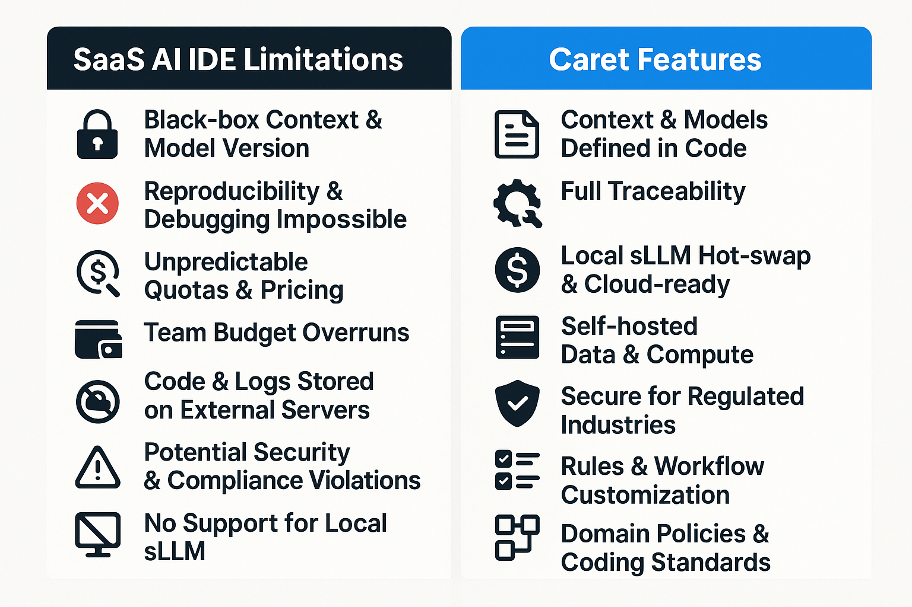

[한국어로 읽기](./README.ko.md)

# Caret: Your AI Development Partner 
<div align="center">

</div>

Caret is a VS Code extension that aims to create a next-generation development environment where developers and AI agents grow together to build software. Through close collaboration with AI, it helps increase development productivity and solve complex problems. ｡•ᴗ•｡💕

> **Note:** This project is a fork of the [Cline](https://github.com/cline/cline) project. Building on the excellent foundation of the original project, we are exploring deeper interactions with AI agents and intelligent development support features. 🌿

## Key Goals and Features

**Why Caret?** Frustrated with the "black box" of existing AI coding tools? Want to control AI agents your way, connect the models you want, and truly customize your development workflow? Caret aims to provide **an experience where developers and AI work together as trusted colleagues**. Understand AI transparently, extend it freely, and grow together like the best teammates.

* **Developer-Driven AI Orchestration:** Instead of opaque internal logic, define and control AI behavior directly with **clear JSON rules (`.caretrules`, persona)**. Understand how AI works and train it to match your project and style.
* **Customizable Workflow (4+1 Modes):** Beyond fixed templates, **design AI roles and interaction methods yourself**. Modify the provided modes (Arch, Dev, Rule, Talk, Empty) or create entirely new ones to build your own AI development partner.
* **Freedom of Model Choice (Local LLM & Privacy):** **Connect any LLM freely** without vendor lock-in. Meet cost, security, and performance requirements while **ensuring data privacy** by utilizing commercial APIs or **local sLLMs**.
* **Practical AI Collaboration:** Beyond simple code generation, aim for an **intelligent partner** that **understands project context (RAG goal)** and solves problems together with developers. Caret will be a platform for exploring AI possibilities and **learning how to collaborate effectively with AI**.
* **Open Source Together (Apache 2.0):** Caret is an **open source project** where we think about and create the future of development in the AI era together. Let's share transparently, contribute freely, and grow together!

## Why Aren't Cursor / Windsurf Enough?
<div align="center">

</div>

| SaaS AI IDE Limitations | Why Control is Critical in Production Development |
|------------------------|--------------------------------------------------|
| **Black Box Context & Model Versions** | Cannot reproduce, debug, or regression test |
| **Plan & Quota Changes** | Budget prediction failure, cost explosion for large teams |
| **Code & Logs on External Servers** | Potential security & regulation (PII, trade secrets) violations |
| **Fixed VS Code Dependent Endpoints** | Difficult to integrate with CLI, CI, other IDEs |
| **Limited Rules & Workflow Customization** | Cannot enforce team coding rules, domain regulations |
| **No Local sLLM Support** | Cannot build air-gapped, low-latency, low-cost environments |
| **File Safety (Text Patches)** | Structure damage, no rollback possible |

> **Caret** provides *complete control* by declaring models, infrastructure, and policies **all as code**.

## Supported Models

Caret supports **105 models** from **20 providers**, giving you the freedom to choose the tools that best fit your needs.

### 🔥 Key Providers

- **Anthropic Claude** (6 models): Claude 3.7 Sonnet, Claude 3.5 Sonnet v2, Claude 3.5 Haiku and other latest high-performance models
- **Google Gemini** (7 models): Gemini 2.5 Pro, Gemini 2.0 Flash, Gemini 1.5 Pro with fast responses and free credits
- **OpenAI Native** (13 models): O3, O1, GPT-4O, ChatGPT-4O Latest with the most model support
- **Qwen** (18 models): Qwen 2.5 Coder series, Qwen Plus, Qwen Max with various model sizes
- **AWS Bedrock** (8 models): Amazon Nova series, Claude models with enterprise-grade stability
- **Local Execution**: Privacy-guaranteed local models via Ollama, LM Studio, VSCode LM

### 📚 Detailed Information

For the complete list of supported models and setup instructions, please refer to the **[Supported Models Guide](./caret-docs/development/support-model-list.mdx)**.

## Getting Started

Caret is actively under development, with many features still in preparation. It's a project we're building together with your interest and participation! Keep watching as we steadily progress! ☕

1. **Code Repository:** Check development progress at [aicoding-caret/caret](https://github.com/aicoding-caret/caret) repository. Star ⭐ and watch the repository if you want to build and use the code directly.
2. **Installation (Future):** Once officially released, you can install "Caret" from the VS Code marketplace. (Coming soon!)
3. **Setup (After Installation):**
   * Customize the provided AI agent personas.
   * Create a `.caretrules` file in your project root to define work modes and rules.
   * Four modes (ARCH, DEV, RULE, TALK) plus an empty mode are provided to optimize for your desired tasks.
4. **Community (Coming Soon):** Latest news and discussions will be available in the [AICoding-Caret Facebook group](https://facebook.com/groups/aicoding-caret).
5. **Official Website (Future):** [caret.team](https://caret.team) (coming soon!)

## Contributing 🤝

Caret is an open source project that welcomes various forms of contribution!

### 🌟 Ways to Contribute

| Contribution Type | Description | Benefits |
|-------------------|-------------|----------|
| **💻 Code Contribution** | Feature development, bug fixes, documentation | Service credits + GitHub contributor listing |
| **🐛 Bug Reports** | Issue reporting, reproduction steps | Service credits |
| **💡 Ideas & Suggestions** | New features, improvement proposals | Service credits |
| **💰 Financial Support** | Project sponsorship, development support | Service credits + special contributor listing |
| **📖 Documentation** | Guide writing, translation, tutorials | Service credits + documentation contributor listing |

### 🎁 Contributor Benefits

- **Service Credits**: Caret service credits based on contribution scale
- **GitHub Recognition**: Name listed in project README and release notes
- **Website Recognition**: Profile featured on official website contributor page
- **Priority Access**: Early access to new features and beta versions

### 🚀 How to Get Started

1. **Check Issues**: Find issues you can contribute to at [GitHub Issues](https://github.com/aicoding-caret/caret/issues)
2. **Join Discussions**: Share feature suggestions or questions in Issues or Discussions
3. **Code Contribution**: Follow Fork → Develop → Pull Request process
4. **Documentation**: Improve or translate documents in the `caret-docs/` folder

For detailed contribution guidelines, please refer to [CONTRIBUTING.md](./CONTRIBUTING.md).

### 🎁 Contributors 

| Profile | GitHub ID | Role |
|---------|-----------|------|
|  | [@potpotakim](https://github.com/potpotakim) | Business Planning, Server & Cloud Development, Community Support |
|  | [@fstory97](https://github.com/fstory97) | Business Planning, Client & AI Research Development, Community Support |
|  | [@ysyang1973](https://github.com/ysyang1973) | Documentation |
|  | [@jikime](https://github.com/jikime) | Community Support, Preview and LangConnect Development |
|  | [@parkjongill](https://github.com/parkjongill) | Business Planning |
|  | [@freelife1191](https://github.com/freelife1191) | Backend Development, ML Ops |
|  | [@allipcloud](https://github.com/allipcloud) | Educational Content Development, Business & Sales Support |
|  | [@jaydenchoe](https://github.com/jaydenchoe) | Educational Material Creation, Educational Content Development, RAG & Memory Development |
|  | [@su-record](https://github.com/su-record) | Client and Service Frontend Development |

## Build & Packaging 🛠️

Follow these steps to set up your local development environment and build the extension.

### 1. Repository Setup

Caret adopts a **Fork-based architecture** from the [Cline](https://github.com/cline/cline) project. Cline's stable codebase is directly included in the `src/` directory, while Caret's unique features are developed in `caret-src/`.

1. **Clone Caret Repository:**
   ```bash
   git clone https://github.com/aicoding-caret/caret.git
   cd caret
   ```

2. **Architecture Structure:**
   ```
   caret/
   ├── src/                    # Cline original code (preserved)
   │   ├── extension.ts        # Cline main entry point
   │   └── core/              # Cline core logic
   ├── caret-src/             # Caret extensions
   │   ├── extension.ts       # Caret entry point (utilizing src/ modules)
   │   └── core/webview/      # Caret-specific WebView Provider
   ├── caret-assets/          # Caret asset management
   │   ├── template_characters/ # AI character templates
   │   ├── rules/             # Basic modes and rule definitions
   │   └── icons/             # Project icons
   ├── caret-docs/            # Caret-specific documentation
   └── webview-ui/            # Frontend (utilizing Cline build system)
       ├── src/components/    # Cline original components
       └── src/caret/         # Caret-specific components
   ```
   
   This structure enables us to **utilize Cline's powerful features as-is** while **safely extending Caret's unique functionality**.

### 2. Install Dependencies

Install all dependencies for the Caret project:

```bash
# Run from caret project root
npm run install:all
```

This command automatically handles:
- Backend dependencies installation (`package.json`)
- Frontend dependencies installation (`webview-ui/package.json`)
- Protocol Buffer compilation tool setup

> **Important**: Skipping this step may result in TypeScript type definition errors or Protocol Buffer compilation errors during the build process.

#### Quick Setup for Windows

For Windows users, we provide a PowerShell script that automates the initial setup:

```powershell
# Run from the project root
.\clean-build-package.ps1
```

This script performs:
- All dependency installation and verification
- Protocol Buffer compilation tool setup
- TypeScript compilation and build verification
- VSIX package creation (optional)

> **Note**: If the script fails, please follow the "Manual Setup" steps below.

#### Manual Setup (When Issues Occur)

If the automated setup script fails or you prefer manual setup:

```bash
# 1. Install dependencies
npm install
cd webview-ui && npm install && cd ..

# 2. Compile Protocol Buffers
npm run protos

# 3. Verify TypeScript compilation
npm run compile
```

### 3. Development Build

Compile the extension's TypeScript code:

```bash
# Compile Protocol Buffers (if needed)
npm run protos

# Compile TypeScript
npm run compile
```

### 4. Run in Development Environment

Press `F5` in VS Code to start a debugging session and test the extension in a new `[Extension Development Host]` window.

**How to Run Caret:**
- Once the extension is running, a **Caret icon** will be added to VS Code's **Primary Sidebar**.
- Click this icon to open the Caret webview and start using it.

**Development Mode Features:**
- **Hot Reload**: Use `npm run watch` for automatic compilation on code changes
- **Debugging**: VS Code debugger support for backend code debugging
- **Logging**: Detailed debug logs available in the development console

## Contributing

The Caret project welcomes your contributions! Please refer to the `CONTRIBUTING.md` file for details.

## Documentation

For more detailed information, please refer to the documents in the [`caret-docs`](./caret-docs/) directory.

* [Architecture Overview](./caret-docs/development/extension-architecture.mmd)
* [Development Guide](./caret-docs/development/caret-architecture-and-implementation-guide.mdx)
* [Upstream Merging Guide](./caret-docs/guides/upstream-merging.mdx)

## License

[Apache 2.0](./LICENSE) © 2024 [Caretive INC.](https://caretive.ai/) 
