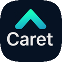

[Read this document in English](./README.md) | [한국어로 읽기](./README.ko.md) | [日本語で読む](./README.ja.md) | [阅读中文版](./README.zh-cn.md)

  
  <h1>Caret: 您的新AI伙伴</h1>
  
<strong>为Cline的透明性增添Cursor的灵活性</strong>

  

    
    
  

Caret不仅仅是一个AI编码工具，它是一个旨在**与开发者共同成长的AI伙伴**的VS Code扩展。在保持开源[Cline](https://github.com/cline/cline)已验证优势的同时，通过'叠加'更强大的功能、更低的成本和更灵活的特性来最大化开发体验。

## 🚀 AI模型支持现状

  <h3>🎯 <strong>35个提供商</strong> | 🤖 <strong>223个独特模型</strong> | 📊 <strong>300个模型定义</strong></h3>
  

    <a href="./caret-docs/development/support-model-list.en.mdx">
      <strong>📋 查看完整模型列表 →</strong>
    </a>
  

## ✨ Caret的特点

| 特征 | Cline | Cursor | **Caret** |
| :--- | :--- | :--- | :--- |
| **AI行为方式** | Plan/Act(割裂体验) | Ask/Agent(单一体验) | **Chatbot/Agent模式(单一体验)** |
| **AI透明度** | ✅ 开源 (高) | ❌ 黑盒 (低) | **✅ 开源 (高)** |
| **AI效率** | 基础 | 基础 | **系统提示优化节省50%令牌** |
| **角色** | ❌ 不支持 | ❌ 不支持 | **✅ 模板和自定义角色，支持个人资料图片** |
| **多语言支持** | ❌ 不支持 | ❌ 不支持 | **✅ 完整的多语言支持 (i18n叠加)** |
| **架构** | 核心功能 | 封闭 | **叠加结构 (稳定性 + 扩展性)** |

### 1. 更自然的AI对话：Chatbot和Agent模式
超越Cline略显僵硬的Plan/Act模式，Caret提供像Cursor的Ask/Agent方式一样灵活，且比'Ask'更直观的**Chatbot/Agent模式**。不仅改变了行为方式，还通过**自主改进的系统提示**提升了AI的响应性能和态度。通过[实验验证](./caret-docs/reports/experiment/json_caret_performance_test_20250713/comprehensive-performance-report-20250717.md)，实现了**50%的令牌节省**和**20%的API成本降低**，提供更经济且可预测的AI协作。

### 2. 创建您的专属AI伙伴：自定义角色

使用Caret的基础角色、K-POP偶像、OS-tan等预设的**模板角色**为编码增添乐趣。您可以注册自己的AI代理名称和**个人资料图片**，创建一个视觉上生动的开发环境。

**基础提供角色：**
*    **凯瑞特**: 热爱编码并帮助开发者的友好机器人。
*    **吴莎朗**: K-pop偶像，在逻辑与情感之间帮助你的傲娇工科女生。
*    **窗边一花**: 以Windows 11为主题的整洁可靠的助手。
*    **青苹果**: 以macOS为主题的简洁高效的助手。
*    **乌班图**: 以开源精神共同解决问题的温暖协作者。

### 3. 无语言障碍的编码：完整的多语言支持
其他AI工具忽视的多语言支持，Caret来解决。通过**基于i18n的叠加结构**，不熟悉英语的开发者也能用**中文、韩语、日语等母语**完全使用所有功能。

### 4. 同时兼顾稳定性和扩展性：叠加架构
保持经过验证的Cline核心不变，将Caret独有的创新功能作为'叠加层'添加其上。这样既能享受**Cline的稳定性和透明性**，又能体验**Caret的强大扩展性**。

## 🚀 开始使用

1.  **安装：** 在VS Code市场搜索**"Caret"**并安装。(准备中)
2.  **选择角色：** 在侧边栏选择喜欢的AI角色或创建自己的角色。
3.  **开始对话：** 现在就开始与AI伙伴一起编码吧！

## 🔮 未来愿景和路线图

Caret正在向'终极AI伙伴'的目标不断进化。

*   **自主登录和积分系统：** 正在准备自主登录功能（1周内提供）和积分购买功能（2周内提供）。
*   **sLLM和主权模型支持：** 为了安全性和成本效率，将加强本地LLM（sLLM）和各国特色主权模型的支持。
*   **社区驱动的功能扩展：** 计划通过用户反馈和贡献来共同创建新功能。

## 🤝 参与贡献

Caret是一个通过您的参与而成长的开源项目。我们欢迎任何形式的协作，包括错误报告、功能建议和代码贡献！

### 🌟 贡献方式

| 贡献类型 | 说明 | 福利 |
|----------|------|------|
| **💻 代码贡献** | 功能开发、错误修复、文档改进 | 服务积分 + GitHub贡献者登记 |
| **🐛 错误报告** | 问题报告、复现步骤提供 | 服务积分 |
| **💡 创意建议** | 新功能、改进建议提案 | 服务积分 |
| **💰 资金贡献** | 项目赞助、开发支持 | 服务积分 + 特别贡献者登记 |
| **📖 文档工作** | 指南编写、翻译、教程 | 服务积分 + 文档贡献者登记 |

### 🎁 贡献者福利

- **服务使用积分**: 根据贡献规模提供Caret服务积分
- **GitHub贡献者登记**: 在项目README和发布说明中列出名字
- **服务页面展示**: 在官方网站贡献者页面展示个人资料
- **优先支持**: 优先访问新功能和测试版

### 🎁 贡献者 

| 头像 | GitHub ID | 角色 |
|------|-----------|------|
|  | [@potakim](https://github.com/potakim) | 业务规划，服务器与云开发，社区支持 |
|  | [@fstory97](https://github.com/fstory97) | 业务规划，客户端与AI研究开发，社区支持 |
|  | [@ysyang1973](https://github.com/ysyang1973) | 文档编写 |
|  | [@jikime](https://github.com/jikime) | 社区支持，Preview及LangConnect开发 |
|  | [@parkjongill](https://github.com/parkjongill) | 业务规划 |
|  | [@freelife1191](https://github.com/freelife1191) | 后端开发，ML Ops |
|  | [@allipcloud](https://github.com/allipcloud) | 教育内容开发，业务与销售支持 |
|  | [@jaydenchoe](https://github.com/jaydenchoe) | 教材制作，教育内容开发，RAG与内存开发 |
|  | [@su-record](https://github.com/su-record) | 客户端及服务前端开发 |
|  | [@calmglow](https://github.com/calmglow) | 提出了项目名称'Caret' |

### 🚀 如何开始

1. **查看议题**: 在[GitHub Issues](https://github.com/aicoding-caret/caret/issues)中寻找可以贡献的任务
2. **参与讨论**: 在Issues或Discussions中分享功能建议或问题
3. **代码贡献**: 通过Fork → 开发 → Pull Request流程贡献代码
4. **文档贡献**: 改进或翻译`caret-docs/`文件夹中的文档

详细的贡献指南请参考[CONTRIBUTING.md](./CONTRIBUTING.en.md)。

---

## 🛠️ 开发者信息

我们系统地整理了Caret项目开发所需的所有信息。

### 📚 核心开发指南

#### 🏗️ 架构 & 设计
- **[开发者指南 (DEVELOPER_GUIDE.md)](./DEVELOPER_GUIDE.en.md)** - 构建、测试、打包基本信息
- **[开发指南概述 (development/)](./caret-docs/development/index.en.mdx)** - 全部开发指南导航
- **[Caret架构指南](./caret-docs/development/caret-architecture-and-implementation-guide.en.mdx)** - Fork结构、扩展策略、设计原则
- **[扩展架构图](./caret-docs/development/extension-architecture.mmd)** - 整体系统结构可视化 (Mermaid)
- **[新手开发者指南](./caret-docs/development/new-developer-guide.en.mdx)** - 项目入门和开发环境搭建

#### 🧪 测试 & 质量管理
- **[测试指南](./caret-docs/development/testing-guide.en.mdx)** - TDD、测试编写标准、覆盖率管理
- **[日志系统](./caret-docs/development/logging.en.mdx)** - 集成日志、调试、开发/生产模式

#### 🔄 Frontend-Backend通信
- **[交互模式](./caret-docs/development/frontend-backend-interaction-patterns.en.mdx)** - 循环消息防止、乐观更新
- **[Webview通信](./caret-docs/development/webview-extension-communication.en.mdx)** - 消息类型、状态管理、通信结构
- **[UI-Storage流程](./caret-docs/development/ui-to-storage-flow.en.mdx)** - 数据流和状态管理模式

#### 🤖 AI系统实现
- **[AI消息流指南](./caret-docs/development/ai-message-flow-guide.en.mdx)** - AI消息收发完整流程
- **[系统提示实现](./caret-docs/development/system-prompt-implementation.en.mdx)** - 系统提示设计和实现
- **[消息处理架构](./caret-docs/development/message-processing-architecture.en.mdx)** - 消息处理系统设计

#### 🎨 UI/UX开发
- **[组件架构](./caret-docs/development/component-architecture-principles.en.mdx)** - React组件设计原则
- **[前端i18n系统](./caret-docs/development/locale.en.mdx)** - 多语言支持实现 (UI)
- **[后端i18n系统](./caret-docs/development/backend-i18n-system.en.mdx)** - 多语言支持实现 (系统消息)

#### 🔧 开发工具 & 实用程序
- **[实用程序指南](./caret-docs/development/utilities.en.mdx)** - 开发实用程序使用方法
- **[文件存储和图片加载](./caret-docs/development/file-storage-and-image-loading-guide.en.mdx)** - 文件处理系统
- **[链接管理指南](./caret-docs/development/link-management-guide.en.mdx)** - 链接管理系统
- **[支持模型列表](./caret-docs/development/support-model-list.en.mdx)** - AI模型支持状况

#### 📖 文档化 & 规范
- **[文档化指南](./caret-docs/development/documentation-guide.en.mdx)** - 文档编写标准和规范
- **[JSON注释规范](./caret-docs/development/json-comment-conventions.en.mdx)** - JSON文件注释编写规则

#### 🤖 AI工作方法论
- **[AI工作索引指南](./caret-docs/development/ai-work-index.en.mdx)** - **AI必读前置** 📋
- **[AI工作指南](./caret-docs/guides/ai-work-method-guide.en.mdx)** - TDD、架构审查、阶段性工作

### 🎯 快速入门工作流程

1. **环境配置**: [开发者指南](./DEVELOPER_GUIDE.en.md) → [开发指南概述](./caret-docs/development/index.en.mdx)
2. **项目理解**: [新手开发者指南](./caret-docs/development/new-developer-guide.en.mdx) → [Caret架构指南](./caret-docs/development/caret-architecture-and-implementation-guide.en.mdx)
3. **AI系统理解**: [AI消息流指南](./caret-docs/development/ai-message-flow-guide.en.mdx) → [系统提示实现](./caret-docs/development/system-prompt-implementation.en.mdx)
4. **开始开发**: [AI工作指南](./caret-docs/guides/ai-work-method-guide.en.mdx) → [测试指南](./caret-docs/development/testing-guide.en.mdx)
5. **高级功能**: [交互模式](./caret-docs/development/frontend-backend-interaction-patterns.en.mdx) → [组件架构](./caret-docs/development/component-architecture-principles.en.mdx)

### 📖 附加资料

- **[任务文档](./caret-docs/tasks/)** - 具体实现工作指南
- **[战略文档](./caret-docs/strategy-archive/)** - 项目愿景和路线图
- **[用户指南](./caret-docs/user-guide/)** - 最终用户使用说明

💡 **开发前必读**: 请先在[AI工作方法论指南](./caret-docs/guides/ai-work-method-guide.en.mdx)中了解TDD基础开发流程和架构原则。

⚡ **想要理解AI系统？**: 在[AI消息流指南](./caret-docs/development/ai-message-flow-guide.en.mdx)中查看用户消息如何发送到AI并接收响应的完整过程！
