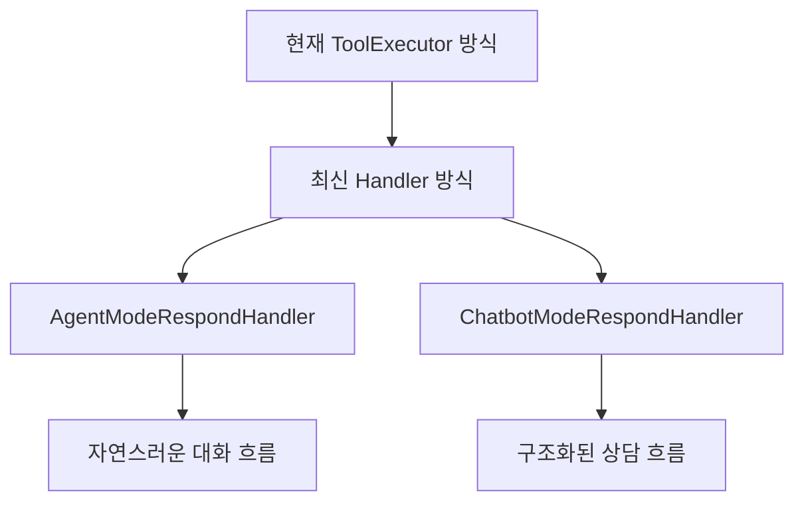

# 027-4: Agent/Chatbot 대화 흐름 완성 - Handler 아키텍처 전환

**작성일**: 2025-08-28  
**상태**: 🚧 **계획 수립 완료**  
**우선순위**: ✨ **CRITICAL** - Agent 모드 대화 불가 문제 해결  

---

## 🎯 **문제 분석**

### **현재 상황**
- **Agent 모드**: AI 응답 후 대화 입력창이 비활성화되어 연속 대화 불가
- **Chatbot 모드**: 정상 동작하지만 최적화 여지 존재
- **근본 원인**: 현재 `ToolExecutor` 기반 구현 vs 최신 Cline `Handler` 아키텍처 간의 차이

### **최신 Cline 분석 결과 (2025-08-27)**
```typescript
// 최신 Cline: PlanModeRespondHandler 클래스
export class PlanModeRespondHandler implements IToolHandler {
    readonly name = "plan_mode_respond"
    
    // 버튼 제거 지원
    plan_mode_respond: {
        enableButtons: false,
        primaryText: undefined,
        secondaryText: undefined
    }
    
    // 스트리밍 지원
    async handlePartialBlock(block: ToolUse, uiHelpers: StronglyTypedUIHelpers) {
        // 실시간 스트리밍 처리
    }
}
```

**발견사항**: 최신 Plan Mode가 **정확히 우리가 원하는 Chatbot/Agent 모드 UX**를 제공합니다.

---

## 🚀 **해결 전략: Handler 아키텍처 전환**

### **핵심 아이디어**
1. **plan_mode_respond 직접 사용 불가**: PLAN MODE 전용 제약
2. **최신 Handler 아키텍처 활용**: `PlanModeRespondHandler`를 기반으로 확장
3. **Upstream 머징 필요**: 최신 Cline 기능을 통합해야 함

### **전략적 접근**


---

## 📋 **4단계 실행 계획**

### **Phase 1: 환경 준비 및 Upstream 머징** ⏱️ 1-2시간

#### **1.1 작업 백업**
```bash
cd D:\dev\caret\cline-latest
git stash push -m "WIP: Agent conversation flow work - before upstream merge"
```

#### **1.2 Upstream 머징**
```bash
# Upstream 원격 저장소 추가
git remote add upstream https://github.com/cline/cline.git

# 최신 버전 가져오기
git fetch upstream

# 머징 (충돌 해결 필요할 수 있음)
git merge upstream/main
```

#### **1.3 환경 정리**
```bash
# 중복 디렉토리 제거
rm -rf D:\dev\cline-latest-new

# 빌드 테스트
npm run compile
npm run build:webview
```

### **Phase 2: Handler 아키텍처 도입** ⏱️ 3-4시간

#### **2.1 Handler 클래스 분석 및 적용**
```typescript
// 목표: 최신 PlanModeRespondHandler 구조 분석
// 위치: D:\dev\caret\cline-latest\src\core\task\tools\handlers\PlanModeRespondHandler.ts

interface IToolHandler {
    readonly name: string
    getDescription(block: ToolUse): string
    execute(config: TaskConfig, block: ToolUse): Promise<ToolResponse>
}

interface IPartialBlockHandler {
    handlePartialBlock(block: ToolUse, uiHelpers: StronglyTypedUIHelpers): Promise<void>
}
```

#### **2.2 ToolExecutorCoordinator 업데이트**
- Handler 등록 시스템 확인
- Caret 전용 Handler 등록 방법 구현

### **Phase 3: Caret 전용 Handler 구현** ⏱️ 2-3시간

#### **3.1 AgentModeRespondHandler 구현**
```typescript
// caret-src/core/task/tools/handlers/AgentModeRespondHandler.ts
export class AgentModeRespondHandler extends PlanModeRespondHandler {
    readonly name = "agent_mode_respond"
    
    async execute(config: TaskConfig, block: ToolUse): Promise<ToolResponse> {
        // Agent 모드 전용 로직
        // - 모든 도구 사용 가능
        // - 자유로운 대화 흐름
        // - 버튼 없는 자연스러운 UX
        
        return super.execute(config, block)
    }
}
```

#### **3.2 ChatbotModeRespondHandler 구현**
```typescript
// caret-src/core/task/tools/handlers/ChatbotModeRespondHandler.ts
export class ChatbotModeRespondHandler extends PlanModeRespondHandler {
    readonly name = "chatbot_mode_respond"
    
    async execute(config: TaskConfig, block: ToolUse): Promise<ToolResponse> {
        // Chatbot 모드 전용 로직
        // - 안전한 도구만 사용
        // - 구조화된 상담 흐름
        // - 필요시 승인 워크플로우
        
        return super.execute(config, block)
    }
}
```

#### **3.3 ButtonConfig 최신화**
```typescript
// 최신 Cline 스타일 적용
agent_mode_respond: {
    sendingDisabled: false,
    enableButtons: false,
    primaryText: undefined,
    secondaryText: undefined,
    primaryAction: undefined,
    secondaryAction: undefined,
}
```

### **Phase 4: 테스트 및 검증** ⏱️ 1-2시간

#### **4.1 기존 테스트 업데이트**
- Handler 기반 테스트로 전환
- Mock Handler 생성
- Integration 테스트 수정

#### **4.2 새로운 Handler 테스트 작성**
```typescript
describe('AgentModeRespondHandler', () => {
    it('should enable all tools', () => {
        // Agent 모드 도구 제한 없음 테스트
    })
    
    it('should provide continuous conversation flow', () => {
        // 연속 대화 흐름 테스트
    })
})
```

#### **4.3 실제 환경 검증**
- F5 디버그 모드 실행
- Agent 모드 대화 연속성 확인
- Chatbot 모드 안전성 확인
- 기존 기능 회귀 테스트

---

## 🎯 **예상 성과**

### **기능적 개선**
- ✅ **Agent 모드 연속 대화**: AI 응답 후 즉시 추가 질문 가능
- ✅ **최신 UX**: Cline의 최신 사용자 경험 적용
- ✅ **스트리밍 지원**: 실시간 응답 표시
- ✅ **옵션 선택**: 사용자 선택지 제공 및 추적

### **기술적 혜택**
- ✅ **최신 아키텍처**: Handler 패턴으로 현대적 구조
- ✅ **Forward Compatibility**: 향후 Cline 업데이트 자동 반영
- ✅ **코드 일관성**: Cline 표준과 일치
- ✅ **확장성**: 새로운 도구/모드 쉽게 추가

### **아키텍처 개선**
- ✅ **분리된 관심사**: Handler별 독립적 로직
- ✅ **테스트 용이성**: 단위 테스트 작성 간편
- ✅ **유지보수성**: 명확한 책임 분리

---

## ⚠️ **위험 요소 및 대응**

### **머징 충돌 위험**
- **문제**: 6개월간 누적된 변경사항으로 충돌 가능
- **대응**: 단계별 머징, 충돌 해결 시간 충분히 확보

### **기존 기능 영향**
- **문제**: Handler 전환으로 기존 Caret 기능 영향 가능
- **대응**: 철저한 회귀 테스트, 단계별 검증

### **작업 시간 초과**
- **문제**: 예상보다 복잡한 구조 변경 필요 가능
- **대응**: Phase별 완료 기준 명확화, 단계적 접근

---

## 📊 **성공 기준**

### **최소 성공 기준 (MVP)**
- [ ] Agent 모드에서 AI 응답 후 연속 대화 가능
- [ ] Chatbot 모드 기존 기능 100% 보존
- [ ] 기존 Persona 시스템 등 영향 없음
- [ ] 컴파일 및 기본 테스트 통과

### **완전 성공 기준**
- [ ] 최신 Cline Handler 아키텍처 완전 적용
- [ ] 스트리밍 지원으로 실시간 응답
- [ ] 옵션 선택 기능으로 향상된 UX
- [ ] 모든 테스트 통과 및 문서화 완료

---

## 🔗 **참고 문서**

### **핵심 가이드**
- **[027 Clean Migration Strategy](./027-clean-migration-strategy.md)**: 전체 마이그레이션 맥락
- **[Merging Strategy Guide](../guides/merging-strategy-guide.md)**: 머징 전략 및 위험 관리
- **[Caret Independent System](../features/caret-independent-system.mdx)**: 독립 시스템 설계 원칙

### **작업 로그**
- **[Next Session Guide](../work-logs/luke/next-session-guide.md)**: 이전 세션 분석 및 계획

### **아키텍처 참조**
- **[Caret Architecture Guide](../development/caret-architecture-and-implementation-guide.mdx)**: 전체 아키텍처 가이드

---

## 🚀 **시작하기**

### **즉시 실행 명령어**
```bash
# 1. 현재 작업 백업
cd D:\dev\caret\cline-latest
git stash push -m "WIP: Before handler architecture transition"

# 2. Upstream 머징 준비
git remote add upstream https://github.com/cline/cline.git
git fetch upstream

# 3. 머징 실행 (주의: 충돌 해결 필요)
git merge upstream/main
```

### **다음 세션 시작점**
1. **`next-session-guide.md`** 읽고 현재 상황 파악
2. **Phase 1** 부터 단계적 실행
3. 각 Phase 완료 후 **체크포인트** 생성
4. 문제 발생 시 **백업 지점**으로 복구

---

**✨ 이 계획을 통해 Caret의 Agent/Chatbot 모드가 최신 Cline의 자연스러운 대화 흐름을 완벽히 구현할 수 있습니다!**

---

**작성**: Claude Code Assistant  
**검토**: 다음 세션에서 실행 예정  
**예상 완료**: 2025-08-29