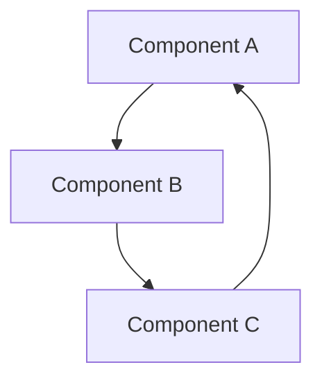
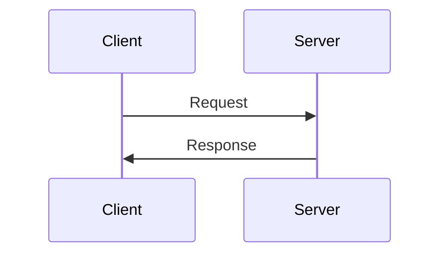

# 문서화 가이드

## 1. 개요

이 문서는 Careti 프로젝트의 문서화 표준과 가이드라인을 설명합니다. 코드 주석, API 문서, 아키텍처 문서 등 모든 종류의 문서화에 대한 지침을 제공합니다.

## 2. 문서 구조: AI-개발자 지식 동기화

Careti의 문서 시스템은 **AI와 개발자가 동일한 지식을 공유**하는 것을 목표로 합니다. 이를 위해 '지식 원자화(Knowledge Atomization)'라는 핵심 원칙을 따릅니다.

### 2.1 시스템 구조: `.agents/context` 와 `careti-docs`

Careti의 지식 시스템은 AI를 위한 `.agents/context`와 개발자를 위한 `careti-docs`라는 두 개의 미러링된 디렉토리로 구성됩니다.

1.  **`.agents/context` (AI의 지식 소스)**
    -   AI가 작업을 수행할 때 직접 참조하는 규칙과 워크플로우의 집합입니다.
    -   토큰 효율성과 명확한 해석을 위해 기계가 읽기 좋은 형식(YAML, JSON, 간결한 Markdown)으로 작성됩니다.

2.  **`careti-docs` (개발자의 지식 소스)**
    -   `.agents/context`에 있는 모든 내용을 사람이 읽기 쉬운 형식(주로 한국어 Markdown)으로 번역하고 설명하는 문서의 집합입니다.
    -   개발자는 이 디렉토리의 문서를 통해 AI가 어떤 원칙과 절차로 작업하는지 명확히 이해할 수 있습니다.

**핵심 원칙**: 두 디렉토리의 내용은 항상 **1:1로 동기화**되어야 합니다.

추가 규칙:
- `docs/`는 Cline 원문(영문)이라 **편집하지 않습니다**.
- `docs.careti.ai/`는 배포용 다국어 문서로, `docs/` 복사본 + Careti 추가분으로 구성됩니다.
- 영문 문서는 `.en` 접미사로 분리합니다(예: `features.en/**`).

### 2.2 지식 원자화 (Knowledge Atomization)

'지식 원자화'는 거대한 단일 규칙 문서를 유지보수하기 쉬운 작은 단위로 분해하는 전략입니다.

**핵심 목표**: AI가 작업을 수행할 때 필요한 문서를 동적으로 읽어 들이므로, 각 문서를 작고 명확한 단위로 분리하여 **API 호출에 사용되는 토큰 수를 줄이고(API 비용 절감)** 시스템 전체의 **지식 중복을 최소화**하는 것을 목표로 합니다.

이를 통해 AI는 거대한 단일 문서를 모두 읽는 대신, 작업에 필요한 최소한의 '지식 원자'만 효율적으로 조합하여 사용할 수 있습니다.

#### 1. 지식의 원자 (Atoms)

-   **위치**: `.agents/context/workflows/atoms/`
-   **역할**: 개발 작업의 가장 근본적이고 재사용 가능한 최소 단위 규칙입니다.
-   **예시**:
    -   `tdd-cycle.yaml`: TDD(테스트 주도 개발)의 기본 사이클 (Red-Green-Refactor)을 정의합니다.
    -   `backup-protocol.yaml`: (Deprecated) 과거 `.cline` 백업 규칙이었으나, 현재는 주석(`// CARETI MODIFICATION:`) + git 기반 복구로 대체합니다.
    -   `verification-steps.md`: 작업 후 'Test→Compile→Execute' 검증 절차를 정의합니다.

#### 2. 복합 워크플로우 (Composite Workflows)

-   **위치**: `.agents/context/workflows/`
-   **역할**: 특정 목표(예: '새 컴포넌트 생성')를 달성하기 위한 구체적인 작업 절차입니다. 이 워크플로우는 여러 '지식 원자'들을 참조하고 조합하여 구성됩니다.
-   **예시**:
    -   `new-component.md`: 새 컴포넌트를 생성하는 워크플로우입니다. 내부적으로 `tdd-cycle`, `naming-conventions`, `verification-steps` 등의 '원자'들을 순서에 맞게 조합하여 사용하도록 AI에게 지시합니다.
    -   `cline-modification.md`: Cline 원본 파일을 안전하게 수정하는 절차를 정의하며, `backup-protocol`, `comment-protocol` 등의 '원자'를 활용합니다.

### 2.3 문서 디렉토리 구조

Careti 프로젝트의 모든 문서는 최상위 `careti-docs/` 디렉토리 내에 체계적으로 관리됩니다.

```
careti-docs/
├── development/     # AI와 개발자를 위한 핵심 개발 가이드 및 아키텍처 문서
├── features/        # 각 기능(Feature)에 대한 상세 설명 및 명세
├── features.en/     # 기능 스펙(영문)
├── guides/          # 특정 주제에 대한 심층 가이드 (예: 병합 전략)
├── system-prompts-ko/ # AI 시스템 프롬프트의 한국어 버전 (가독성용)
├── user-guide/      # 최종 사용자를 위한 기능 안내서
└── work-logs/       # AI와 개발자의 일일 작업 로그
```

### 2.4 문서 파일 명명 규칙

- 소문자와 하이픈 사용
- 의미 있는 이름 사용
- 확장자는 `.md` 사용
- 예: `webview-extension-communication.md`

### 2.5 문서/AI 가이드 업데이트 절차

#### A) 문서 업데이트 (사람용)
1. SoT 문서를 먼저 수정합니다 (`.agents/context/**`).
2. 대응되는 한국어 가이드를 `careti-docs/development/**`에 반영합니다.
3. 기능 스펙이 사용자 대상이면 `careti-docs/features.en/**`도 갱신합니다.
4. 진입 문서(`careti-docs/development/index.md`) 링크를 최신화합니다.

#### B) AI 가이드 업데이트 (시스템 프롬프트/행동 규칙)
1. `.agents/context/**`의 규칙/프롬프트 소스를 갱신합니다.
2. 사람이 읽는 프롬프트 문서(`careti-docs/system-prompts-ko/**`)를 함께 갱신합니다.
3. 개발자 영향이 있는 변화는 `careti-docs/development/**`에 요약을 추가합니다.
4. 워크플로우/카테고리가 바뀌면 `ai-work-index.yaml`도 갱신합니다.

### 2.6 워크플로우 → 스킬 후보 검토
반복적이고 결정 규칙이 명확하며, 스크립트로 자동화 가능한 작업은 스킬화 후보입니다.
- 예: 모델 리스트 갱신, proto 생성, 표준 빌드/린트 실행
- 제외: 아키텍처 판단/리뷰 등 인간 판단이 필요한 작업

### 2.7 워크플로우 vs 스킬 (다른 시스템)
- **워크플로우**: `.agents/context/workflows/**`에 있는 프로젝트 규칙/절차 문서이며, 작업 맥락에 따라 온디맨드로 로드됩니다.
- **스킬**: `.agents/skills/**`의 Codex 기능 모듈로, 스킬 이름을 언급하거나 설명이 요청과 일치할 때만 로드됩니다.
- 결정 규칙이 명확하고 스크립트로 자동화 가능한 경우에만 워크플로우를 스킬로 전환합니다.

### 2.8 AGENTS 표준 초기화 (/init)
- 표준 구조가 없으면 사용자 동의를 먼저 받습니다.
- 동의 시 `assets/agents_template`를 스캐폴드하고, 프로젝트 컨텍스트를 채웁니다.
- 채움 절차는 `.agents/context/workflows/agents-init.md`를 기준으로 수행합니다.
- 확인되지 않은 정보는 작성하지 말고, 필요한 경우 사용자에게 질문합니다.

## 3. 마크다운 작성 규칙

### 3.1 기본 구조

```markdown
# 문서 제목

## 1. 개요

문서의 목적과 범위를 설명합니다.

## 2. 주요 내용

핵심 내용을 설명합니다.

## 3. 세부 내용

상세한 설명을 제공합니다.

## 4. 예제

코드 예제나 사용 예시를 제공합니다.

## 5. 참고 사항

추가 정보나 주의사항을 설명합니다.

## 6. 업데이트 기록

- YYYY-MM-DD: 변경 내용
```

### 3.2 코드 블록

````markdown
```typescript
// TypeScript 코드 예제
interface Config {
	name: string
	version: string
}
```
````

````

### 3.3 표
```markdown
| 항목 | 설명 | 비고 |
|------|------|------|
| 항목1 | 설명1 | 비고1 |
| 항목2 | 설명2 | 비고2 |
````

## 4. 코드 문서화

### 4.1 JSDoc 주석

```typescript
/**
 * 클래스 설명
 * @class
 */
class MyClass {
	/**
	 * 메서드 설명
	 * @param {string} param1 - 첫 번째 매개변수 설명
	 * @param {number} param2 - 두 번째 매개변수 설명
	 * @returns {boolean} 반환값 설명
	 */
	method(param1: string, param2: number): boolean {
		return true
	}
}
```

### 4.2 인터페이스 문서화

```typescript
/**
 * 설정 인터페이스
 * @interface
 */
interface Config {
	/** 설정 이름 */
	name: string
	/** 설정 버전 */
	version: string
	/** 설정 옵션 */
	options?: {
		/** 옵션 활성화 여부 */
		enabled: boolean
		/** 옵션 값 */
		value: number
	}
}
```

## 5. API 문서화

### 5.1 API 엔드포인트 문서화

````markdown
## API 엔드포인트

### GET /api/resource

리소스를 조회합니다.

#### 요청

- URL: `/api/resource`
- Method: `GET`
- Headers:
    - `Authorization`: Bearer 토큰

#### 응답

```json
{
	"id": "string",
	"name": "string",
	"createdAt": "string"
}
```
````

#### 오류 코드

- 401: 인증 실패
- 404: 리소스 없음

````

### 5.2 API 클라이언트 문서화
```typescript
/**
 * API 클라이언트
 * @class
 */
class ApiClient {
  /**
   * 리소스 조회
   * @param {string} id - 리소스 ID
   * @returns {Promise<Resource>} 리소스 객체
   * @throws {ApiError} API 오류
   */
  async getResource(id: string): Promise<Resource> {
    // 구현
  }
}
````

## 6. 아키텍처 문서화

### 6.1 컴포넌트 다이어그램



### 6.2 시퀀스 다이어그램



## 7. 모범 사례

### 7.1 문서화 원칙

- 명확하고 간결한 설명
- 일관된 형식과 스타일
- 최신 상태 유지
- 예제와 함께 설명

### 7.2 코드 주석 원칙

- 코드가 자체적으로 설명되지 않을 때만 주석 추가
- "왜"에 대한 설명 제공
- 중복 설명 피하기
- 주석도 코드처럼 관리

### 7.3 CARETI MODIFICATION 주석 가이드라인

Cline 원본 파일을 수정할 때는 파일 타입에 맞는 주석 형식으로 CARETI MODIFICATION 주석을 추가해야 합니다.

#### 7.3.1 파일 타입별 주석 형식

**JavaScript/TypeScript 파일 (.js, .ts, .jsx, .tsx)**

```typescript
// CARETI MODIFICATION: 변경 사항 설명
// Original backed up to: 백업파일경로
// Purpose: 변경 목적
```

**CSS 파일 (.css, .scss, .sass)**

```css
/* CARETI MODIFICATION: 변경 사항 설명
   Original backed up to: 백업파일경로
   Purpose: 변경 목적 */
```

**HTML 파일 (.html, .htm)**

```html
<!-- CARETI MODIFICATION: 변경 사항 설명
     Original backed up to: 백업파일경로
     Purpose: 변경 목적 -->
```

**Markdown 파일 (.md, .md)**

```markdown
<!-- CARETI MODIFICATION: 변경 사항 설명
     Original backed up to: 백업파일경로
     Purpose: 변경 목적 -->
```

**Shell Script 파일 (.sh, .bash)**

```bash
# CARETI MODIFICATION: 변경 사항 설명
# Original backed up to: 백업파일경로
# Purpose: 변경 목적
```

**Python 파일 (.py)**

```python
# CARETI MODIFICATION: 변경 사항 설명
# Original backed up to: 백업파일경로
# Purpose: 변경 목적
```

#### 7.3.2 주석을 지원하지 않는 파일 타입

다음 파일 타입들은 주석을 지원하지 않으므로 CARETI MODIFICATION 주석을 추가할 수 없습니다:

- JSON 파일 (.json)
- 이미지 파일 (.png, .jpg, .svg 등)
- 바이너리 파일

이러한 파일들의 경우 별도의 문서나 README 파일에 변경 사항을 기록해야 합니다.

### 7.4 문서 관리 원칙

- 정기적인 리뷰와 업데이트
- 버전 관리 시스템 활용
- 변경 이력 유지
- 검색 가능한 구조

### 7.5 빌드 및 실행 문서화

- **빌드 명령어**: 항상 `npm run compile` 사용
    - `npm run build` 대신 `npm run compile` 사용
    - 빌드 오류 발생 시 타입 체크 확인

- **개발 환경**:
    - Node.js 버전 명시
    - 필요한 전역 패키지 목록
    - 환경 변수 설정 방법

- **실행 방법**:
    - 개발 모드 실행 방법
    - 디버깅 방법
    - 테스트 실행 방법

## 8. 용어 및 호칭 사용 가이드라인

이 섹션은 프로젝트 내 모든 문서 (기술 문서, 작업 문서, 작업 로그, 코드 주석 등) 작성 시 일관된 용어와 호칭 사용을 위한 지침을 제공합니다.

### 8.1 기본 원칙

- **공식 용어 사용**: 문서 본문에서는 "AI"와 "개발자"라는 공식적이고 중립적인 용어를 사용합니다.
- **개인 호칭 제한**: 개인적인 호칭(예: Alpha, Master, Luke 등 특정 이름)은 문서 본문에서는 사용하지 않습니다.
- **작성자/검토자 표기 시 예외**: 개인적인 커스텀 호칭은 문서 하단의 '작성자/검토자' 정보에만 사용할 수 있습니다. 이때, 공식적인 역할(예: AI 어시스턴트, 개발자)을 괄호 안에 병기합니다.
- **본문 내 인물 지칭**: 문서 본문에서 특정 역할을 지칭해야 할 경우, "AI 어시스턴트" 또는 "개발자"로 표기합니다.

### 8.2 용어 사용 예시

**올바른 예시:**

- 본문: "AI가 코드를 분석한 결과..."
- 본문: "개발자의 검토 후 다음 단계로 진행합니다."
- 작성자 표기: "작성: Alpha (AI 어시스턴트)"
- 작성자 표기: "검토: Luke (개발자)"

**피해야 할 예시 (본문):**

- "Alpha가 분석한 결과..." (X - 개인 호칭 사용)
- "AI가 분석한 결과..." (O - 중립적 용어 사용)
- 본문 내 개인 호칭 사용 예시 (O - 권장하는 경우):
    - "AI가 분석을 완료했습니다."
    - "개발자는 문서를 검토한 후 피드백을 제공합니다."

### 8.3 문서 작성자/검토자 표기 표준

문서 하단 또는 메타 정보에 작성자와 검토자를 명시할 때는 다음 형식을 따릅니다:

```
작성: [개인 호칭/이름] (AI 어시스턴트 | 개발자)
검토: [개인 호칭/이름] (AI 어시스턴트 | 개발자)
```

예시:

```
작성: Alpha (AI 어시스턴트)
검토: Luke (개발자)
```

또는

```
작성: Luke (개발자)
검토: Alpha (AI 어시스턴트)
```

## 9. 업데이트 기록

- 2024-03-21: 초기 문서 작성
- 2024-03-21: 마크다운 작성 규칙 추가
- 2024-03-21: 코드 문서화 가이드 추가
- 2024-03-21: 모범 사례 추가
